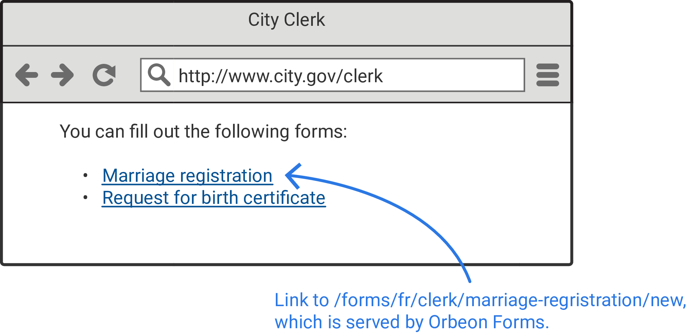
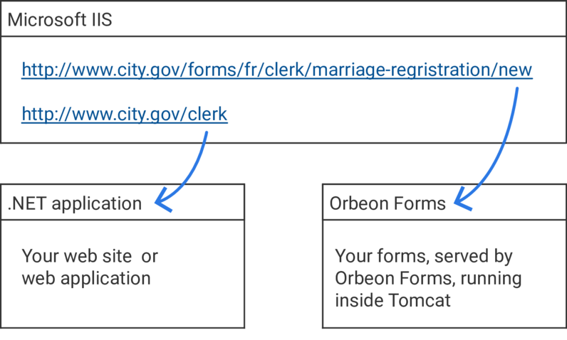

# Linking to Your Forms

## Rationale

When you create a form with Form Builder, you pick an *application name* and *form name* for that form. For instance, for a marriage registration, you might choose `clerk` as the application name, and `marriage-registration` as the form name.

When you publish the form, assuming you have Orbeon Forms deployed on a server on `http://www.city.gov/forms`, citizen will be able to fill out a new marriage registration by going to `http://www.city.gov/forms/fr/clerk/marriage-registration/new`.

In a typical deployment, users will access this page from another part of your web site or web application that contains a link to form served by Orbeon Forms. For instance, a city government might have on its web site a page listing forms citizen can fill out, which links to the marriage registration form on `http://www.city.gov/forms/fr/clerk/marriage-registration/new`.



## Technology agnostic

Linking doesn't make any assumption on the technology used by the web site or application you're linking from. Your site could use Drupal, WordPress, be served by IIS, using .NET, or any other technology. For instance, the diagram below is for a situation where your web site is served by Microsoft IIS, implemented in .NET, and links to forms served by Orbeon Forms.



## Paths

The `/fr/clerk/marriage-registration/new` in our example is what is referred to below as a *path*, and for a given form, multiple such paths exist. Knowing what those paths are is particulary important as this allows you to link from your web site or web application to forms your created with Form Builder. All the paths are relative to the *deployment context*, i.e. where you've deployed Orbeon Forms, which in our example was `http://www.city.gov/forms`.

* Summary page for a given form definition:
    `/fr/[APPLICATION_NAME]/[FORM_NAME]/summary`
* New empty form data:
    `/fr/[APPLICATION_NAME]/[FORM_NAME]/new`
* Edit existing form data:
    `/fr/[APPLICATION_NAME]/[FORM_NAME]/edit/[DOCUMENT_ID]`
* Read-only HTML view:
    `/fr/[APPLICATION_NAME]/[FORM_NAME]/view/[DOCUMENT_ID]`
* Read-only PDF view:
    `/fr/[APPLICATION_NAME]/[FORM_NAME]/pdf/[DOCUMENT_ID]`
* Read-only TIFF view: [SINCE Orbeon Forms 2016.1]
    `/fr/[APPLICATION_NAME]/[FORM_NAME]/tiff/[DOCUMENT_ID]`

## URL parameters

### New empty form data

When using versioning, you can pass the `form-version` URL parameter:

```
/fr/[APPLICATION_NAME]/[FORM_NAME]/new?form-version=2
```

By default, the latest available form definition version is used.

### Modes that load data

This applies to `edit`, `view`, `pdf`, and `tiff` modes.

- `draft`
    - `true`: loads the data for a draft
    - `false` (default): loads the data for a final document

### PDF and TIFF views

- `fr-language`
    - With automatic PDF, selects the language to use when producing the PDF.

[SINCE Orbeon Forms 2018.1]

- `fr-use-pdf-template`
    - Whether to use the PDF template or not. Defaults to `true` if there is one or more PDF templates.
- `fr-pdf-template-name`
    - Selects a PDF template by name.
- `fr-pdf-template-lang`
    - Select a PDF template by language.

## See also

- [Multitenancy](/form-runner/feature/multitenancy.md)
- [Sending PDF and TIFF content: Controlling the format](../advanced/buttons-and-processes/actions-form-runner-send.md)
- [PDF templates](../../form-builder/pdf-templates.md)
