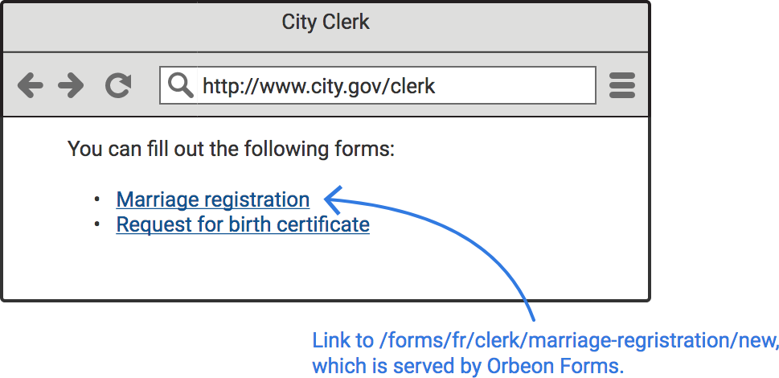
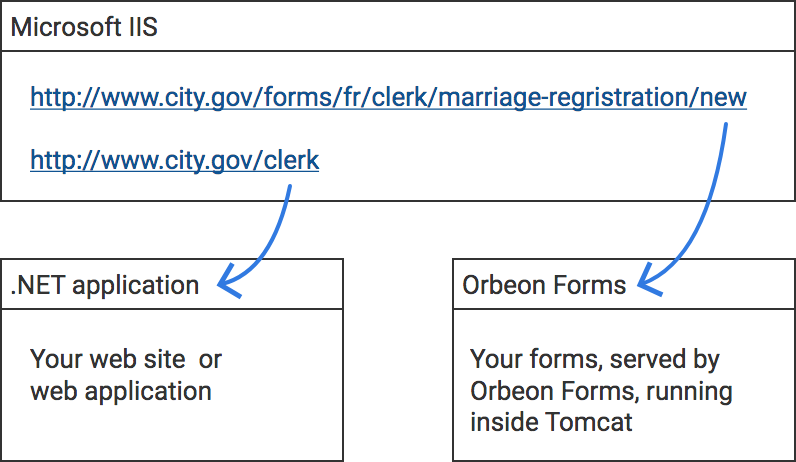

# Linking

## Rationale

When you create a form with Form Builder, you pick an _application name_ and _form name_ for that form. For instance, for a marriage registration, you might choose `clerk` as the application name, and `marriage-registration` as the form name.

When you publish the form, assuming you have Orbeon Forms deployed on a server on `http://www.city.gov/forms`, citizen will be able to fill out a new marriage registration by going to `http://www.city.gov/forms/fr/clerk/marriage-registration/new`.

In a typical deployment, users will access this page from another part of your website or web application that contains a link to form served by Orbeon Forms. For instance, a city government might have on its website a page listing forms citizen can fill out, which links to the marriage registration form on `http://www.city.gov/forms/fr/clerk/marriage-registration/new`.



## Technology agnosticity

Linking doesn't make any assumption on the technology used by the website or application you're linking from. Your site could use Drupal, WordPress, be served by IIS, using .NET, or any other technology. For instance, the diagram below is for a situation where your website is served by Microsoft IIS, implemented in .NET, and links to forms served by Orbeon Forms.



## Paths

The `/fr/clerk/marriage-registration/new` in our example is what is referred to below as a _path_, and for a given form, multiple such paths exist. Knowing what those paths are is particularly important as this allows you to link from your website or web application to forms your created with Form Builder. All the paths are relative to the _deployment context_, i.e. where you've deployed Orbeon Forms, which in our example was `https://www.city.gov/forms`.

| Description                              | Path                                                                        | Availability |
| ---------------------------------------- | --------------------------------------------------------------------------- | ------------ |
| Summary page for a given form definition | `/fr/$app/$form/summary`                                                    |              |
| New empty form data                      | `/fr/$app/$form/new`                                                        |              |
| Edit existing form data                  | `/fr/$app/$form/edit/$document`                                             |              |
| Read-only HTML view                      | `/fr/$app/$form/view/$document`                                             |              |
| Read-only PDF view                       | `/fr/$app/$form/pdf/$document`                                              |              |
| Read-only TIFF view                      | `/fr/$app/$form/tiff/$document`                                             | 2016.1       |
| Excel export with data                   | `/fr/$app/$form/export/$document?export-format=excel-with-named-ranges`     | 2023.1       |
| Excel export without data                | `/fr/$app/$form/export?export-format=excel-with-named-ranges`               | 2023.1       |
| XML export with data                     | `/fr/$app/$form/export/$document?export-format=xml-form-structure-and-data` | 2023.1       |
| XML export without data                  | `/fr/$app/$form/export?export-format=xml-form-structure-and-data`           | 2023.1       |
| PDF export with data                     | `/fr/$app/$form/export/$document?export-format=pdf`                         | 2023.1       |
| TIFF export with data                    | `/fr/$app/$form/export/$document?export-format=tiff`                        | 2023.1       |

Where:

* `$app` is the form definition's application name
* `$form` is the form definition's form name
* `$document` is the form data's document id

By default, the latest published and available form definition version is used. You can request a specific form definition version using the `form-version` parameter. For example:

* `/fr/acme/order/new?form-version=2`
* `/fr/acme/order/edit/fc4c32532e8d35a2d0b84e2cf076bb070e9c1e8e?form-version=3`

## URL parameters

### Summary page

\[SINCE Orbeon Forms 2018.2]

You can pass the `form-version` URL parameter:

```
/fr/$app/$form/summary?form-version=$version
```

Where:

* `$app` is the form definition's application name
* `$form` is the form definition's form name
* `$version` is the form definition version number

The page will return a "Not Found" error if the specified version is not found.

By default, the latest available version is selected.

### New empty form data

When using versioning, you can pass the `form-version` URL parameter:

```
/fr/$app/$form/new?form-version=$version
```

Where:

* `$app` is the form definition's application name
* `$form` is the form definition's form name
* `$version` is the form definition version number

By default, the latest available form definition version is used.

### Modes that load data

This applies to `edit`, `view`, `pdf`, and `tiff` modes.

* `draft`
  * `true`: loads the data for a draft
  * `false` (default): loads the data for a final document

### PDF, TIFF, and other export views

* `fr-language`
  * With automatic PDF and exports, selects the language to use when producing the PDF.
  * With PDF templates, choose the template with the specified language if available.

\[SINCE Orbeon Forms 2018.1]

* `fr-use-pdf-template`
  * Whether to use the PDF template or not. Defaults to `true` if there is one or more PDF templates.
* `fr-pdf-template-name`
  * Selects a PDF template by name.
* `fr-pdf-template-lang`
  * Select a PDF template by language.

### Excel, XML, PDF, and TIFF exports

For exports that use the `/export/` path:

* `export-initialize-form`
  * `true`: initializes and runs the form before exporting
  * `false` (default): does not initialize and run the form before exporting
* `language`
  * language preference, for example `en` or `fr`

### Excel export in `excel-with-named-ranges` format

The following parameters control the number of repetitions created in the Excel file for repeated grids and repeated sections:

* `repeats-at-least`
  * if this is present, the number of repeats is at least the value of this parameter
  * if the data (or form definition template) contains more repetitions, then all repetitions are included
* `repeats-exactly`
  * this is ignored if `repeats-at-least` is present
  * if this is present, the number of repeats is exactly the value of this parameter
  * if the data (or form definition template) contains more repetitions, then only the repetitions up to the value specified are included

## HTTP status codes

### Pages and other client requests

Requesting an Orbeon Forms page is done through an HTTP or HTTPS request. This means that Orbeon Forms will respond with one of the [standard HTTP status codes](https://developer.mozilla.org/en-US/docs/Web/HTTP/Status).

The following types of HTTP requests can be made:

* `GET` for an HTML page or page fragment
* `GET` for a resource such as an image, CSS file, or JavaScript file
* `POST` XHR (Ajax) to the server to update server state and obtain new client state
* `POST` to upload attachments to the server
* `POST` to navigate to another Orbeon Forms page
* `OPTIONS` when the browser asks for some [CORS information](https://developer.mozilla.org/en-US/docs/Web/HTTP/CORS) when using the JavaScript embedding API

Where do I see status codes?

* If you use Orbeon Forms in standalone mode, or using JavaScript embedding, Orbeon Forms status codes can be visible on the client (that is, the web browser) when loading pages and can be examined in your web browser's developer tools.
* Resources, XHR (Ajax), uploads, navigation, and `OPTIONS` requests status codes can be seen in the developer tools as well.
* Status codes are also often logged by web servers or application servers.
* Finally, some error codes are explicitly logged by Orbeon Forms and you can find them in the Orbeon Forms logs.

The following table lists the most common status codes you might encounter when linking to Orbeon Forms pages.

| Status code | Description                                                                                                                                                                                   |
| ----------- | --------------------------------------------------------------------------------------------------------------------------------------------------------------------------------------------- |
| 200         | The request was successful.                                                                                                                                                                   |
| 302         | The requested resource has moved to a different URL and the server is telling the browser where to navigate. This is rarely used for pages, but can be used for baseline embedding resources. |
| 304         | The requested resource has not changed since the last time it was requested. This can be returned for resources.                                                                              |
| 400         | The request was invalid. This is rarely returned by Orbeon Forms for pages. Most likely, this is due to an internal error.                                                                    |
| 403         | The user is not authorized to access the requested page. Or, with Orbeon Forms version prior to 2022.1.5, this can also be returned if the application server session has expired.            |
| 404         | The requested page was not found. This is typically the case when you request a page that doesn't exist, for example if you use an incorrect path or refer to a non-existing form.            |
| 413         | The request was too large. This can happen when the user uploads a file that is too large.                                                                                                    |
| 440         | From Orbeon Forms 2022.1.5 and newer. The application server session has expired. This can happen after periods of inactivity from the user's part.                                           |
| 500         | An error occurred on the server. Check the Orbeon log files for details of the error.                                                                                                         |
| 503         | Service unavailable. This is only returned by Orbeon Forms for an XHR request that is a retry, if the original request is still running. The operation will likely be retried.                |

### Service requests

Service requests are requests for Orbeon Forms server-side [service APIs](../api/), typically:

* called internally by Orbeon Forms
* called by some external application

When called internally, the status codes will not always be returned as is to the client. Instead, individual pages and services handle them as needed. They may opt the to return the same or another appropriate status code to the ultimate caller.

You may or may not have external application service calls, depending on how you are integrating Orbeon Forms in your organization.

Service requests also use HTTP or HTTPS, and Orbeon Forms responds with one of the [standard HTTP status codes](https://developer.mozilla.org/en-US/docs/Web/HTTP/Status).

However, more status codes can be returned for service requests than for pages. The following table lists the most common status codes you might encounter when calling Orbeon Forms services.

| Status code | Description                                                                                                                                                                        |
| ----------- | ---------------------------------------------------------------------------------------------------------------------------------------------------------------------------------- |
| 200         | The request was successful.                                                                                                                                                        |
| 201         | The request was successful and a new resource was created.                                                                                                                         |
| 204         | The request was successful and no content is returned.                                                                                                                             |
| 206         | The request was successful and partial content is returned. This is used for byte ranges when reading from video attachments.                                                      |
| 400         | The request was invalid. This means the path, parameters, headers, and/or request body are invalid.                                                                                |
| 401         | The user is not allowed to perform the specified operation.                                                                                                                        |
| 403         | The user is not authorized to access the requested page. Or, with Orbeon Forms version prior to 2022.1.5, this can also be returned if the application server session has expired. |
| 404         | The requested page was not found. This is typically the case when you request a page that doesn't exist, for example if you use an incorrect path or refer to a non-existing form. |
| 405         | The HTTP method is not allowed.                                                                                                                                                    |
| 409         | There is a conflict with the current state of the resource. This is only used when checking form definition versions.                                                              |
| 410         | The resource is gone. This is only used when reading from the database and we know that the resource has been deleted.                                                             |
| 423         | The resource is locked. This is only used by the Lease feature.                                                                                                                    |
| 440         | From Orbeon Forms 2022.1.5 and newer. The application server session has expired. This can happen after periods of inactivity from the user's part.                                |
| 500         | An error occurred on the server. Check the Orbeon log files for details of the error.                                                                                              |

## Generating links automatically

Some links can be produced automatically by Orbeon Forms.

xxx templates

## See also

* [Multitenancy](../feature/multitenancy.md)
* [Sending PDF and TIFF content: Controlling the format](../advanced/buttons-and-processes/actions-form-runner-send.md)
* [PDF templates](../feature/pdf-templates.md)
