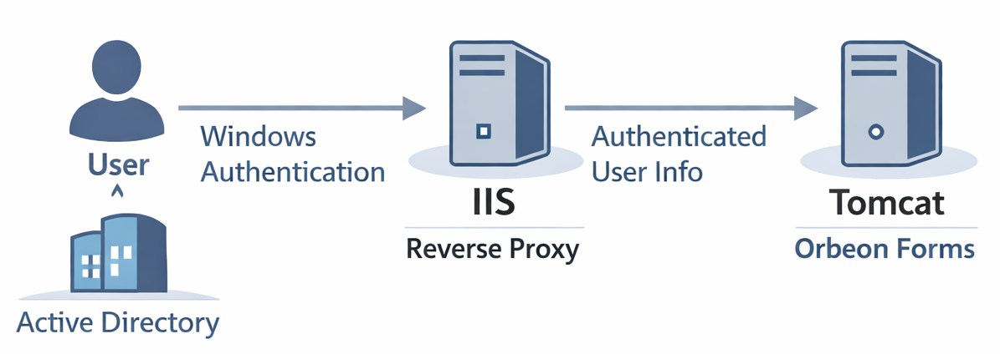

# IIS

## Rationale

Orbeon Forms runs on a Java servlet container such as Tomcat. In some environments, particularly in organizations using Windows-based infrastructure, IIS (Internet Information Services) is the standard web server, and Windows Authentication (often backed by Active Directory) is the required authentication mechanism. In such cases, IIS can act as a reverse proxy in front of Tomcat, and forward the authenticated user's identity to Orbeon Forms. This page will walk you though the steps to set up IIS as a reverse proxy for Orbeon Forms running on Tomcat.

<figure></figure>

## Steps

### Download configuration files

Download the following files by clicking on each link, then clicking on the "Download raw file" button (the button is at the top right of the file, and its icon shows an arrow pointing down):

- [`user.aspx`](iis/user.aspx)
- [`WindowsAuthHeaderModule.cs`](iis/WindowsAuthHeaderModule.cs)
- [`web.config`](iis/web.config)
- [`user.jsp`](iis/user.jsp)
- [`properties-local.xml`](iis/properties-local.xml)

### Ensure IIS knows who the current user is

- If you've already set up a rewrite rule to forward requests to Tomcat, for now, disable that rule.
- Move the `user.aspx` in your site directory (the default is `C:\inetpub\wwwroot`).
- Load [http://localhost/user.aspx]. It should show something like *Page.User.Identity.Name: DOMAIN\Homer Simpson*.

### Pass the user information to Tomcat through a header

- In the directory where you put `user.aspx`, create a directory named `App_Code`. Move the `WindowsAuthHeaderModule.cs` inside that `App_Code` directory. This module sets the `HTTP_ORBEON_USERNAME` variable to the part of Windows username that follows the `\` character.
- Move the `web.config` in the same directory where you have `App_Code` and `user.aspx`.
- Move `user.jsp` in the directory `webapps\ROOT`, inside the Tomcat directory (for instance `C:\Program Files\Apache Software Foundation\Tomcat 10.1\webapps\ROOT`). This page will show the value of the `Orbeon-Username` header.
- Access [http://localhost/user.jsp]. You should see something like: *Forwarded User: Homer Simpson*.

### Configure Orbeon Forms to use the value of that header

- Move the `properties-local.xml` in Tomcat's `webapps\orbeon\WEB-INF\resources\config`.
- From Services, restart Tomcat.
- Access [http://localhost/orbeon/]. On the top-right of the page, you'll see a button with a user profile icon. Click on it. It should show under which username you are logged in, like *Logged in as Homer Simpson*.