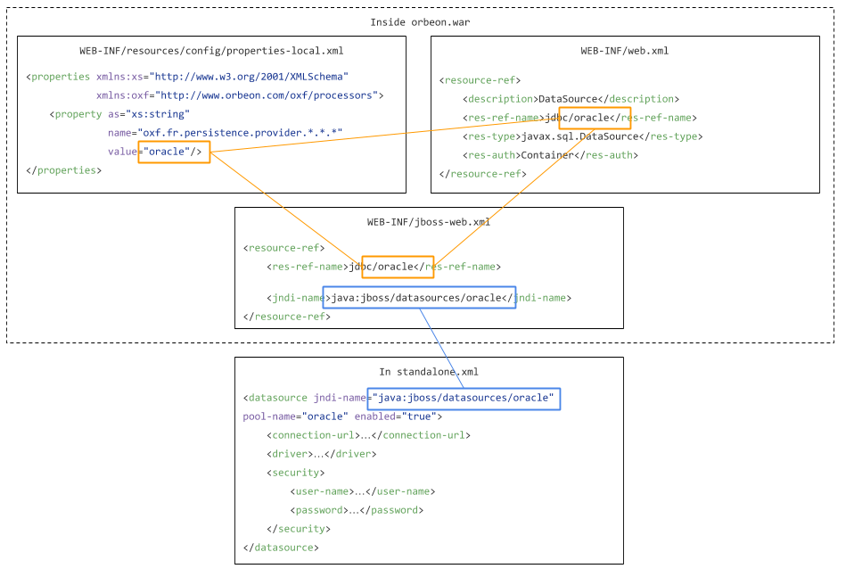

# JBoss 7, JBoss EAP 6

<!-- toc -->

## Status

These steps have been tested with:
 
- JBoss AS 7.1.1.Final "Brontes"
- JBoss EAP 6.4.0.GA (AS 7.5.0.Final) with Orbeon Forms 2016.1

## Deploy Orbeon Forms

To install Orbeon Forms:

1. For Orbeon Forms PE only, either:
    - place your license file under `~/.orbeon/license.xml` (see [License installation](README.md#license-installation-orbeon-forms-pe-only)),
    - or add your `license.xml` to the `orbeon.war` under `WEB-INF/resources/config/license.xml`
2. Start a standalone server with `bin/standalone.sh`
3. Move the `orbeon.war` file into the JBoss `standalone/deployments` folder
4. Check whether the deployment was successful by watching `standalone/log/server.log`

## Setup a JDBC datasource

To setup a datasource, if you'd like Orbeon Forms to connect to your relational database, do the following:

1. Setup Orbeon Forms to use a JBoss datasource (configured in the following steps):
    1. Set the `oxf.fr.persistence.provider.*.*.*` property in your `properties-local.xml`
        1. If you already created a `WEB-INF/resources/config/properties-local.xml` unzip it and add the property per the example below. Otherwise create that file with the following content:

            ```xml
            <properties xmlns:xs="http://www.w3.org/2001/XMLSchema"
                        xmlns:oxf="http://www.orbeon.com/oxf/processors">
                <property as="xs:string"
                          name="oxf.fr.persistence.provider.*.*.*"
                          value="oracle"/>
            </properties>
            ```
        2. Change the value of the property according to the database you're using, setting it either to `oracle`, `mysql`, `sqlserver`, `postgresql`, or `db2`.
        3. Update `WEB-INF/resources/config/properties-local.xml` inside the `orbeon.war` with the version you edited.
    2. Update the `web.xml` 
        1. Unzip the `WEB-INF/web.xml` inside the `orbeon.war`.
        2. Editing `WEB-INF/web.xml`, towards the end of the file, uncomment the following:

            ```xml
            <resource-ref>
                <description>DataSource</description>
                <res-ref-name>jdbc/oracle</res-ref-name>
                <res-type>javax.sql.DataSource</res-type>
                <res-auth>Container</res-auth>
            </resource-ref>
            ```
        3. Inside `<resource-ref>`, replace `oracle` by the name of your database.
        4. Update `WEB-INF/web.xml` inside the `orbeon.war` with the version you edited.
   3. Update the `jboss-web.xml`
        1. Unzip the `WEB-INF/jboss-web.xml` inside the `orbeon.war`.
        2. Editing `WEB-INF/jboss-web.xml`, uncomment the following:

            ```xml
            <resource-ref>
                <res-ref-name>jdbc/db</res-ref-name>
                <jndi-name>java:/my-database</jndi-name>
            </resource-ref>
            ```
        3. Change the `<res-ref-name>` to match what the `<res-ref-name> in your `web.xml`.
        4. Change the `<jndi-name>` to `java:jboss/datasources/oracle`, replacing `oracle` by the database name you used in `<res-ref-name>`.
        4. Update `WEB-INF/jboss-web.xml` inside the `orbeon.war` with the version you edited.
2. In JBoss, install the JDBC driver:
    1. Download the MySQL JDBC driver, say `oracle-driver.jar`, and place it in the `standalone/deployments` directory.
    2. Start the server, and check you see the message `Deployed "oracle-driver.jar" (runtime-name : "oracle-driver.jar")`.
3. In JBoss, define the datasource:
    1. Editing `standalone/configuration/standalone.xml`, inside the `<datasources>` add the following:

        ```xml
        <datasource jndi-name="java:jboss/datasources/oracle" pool-name="oracle" enabled="true">
            <connection-url>…</connection-url>
            <driver>…</driver>
            <security>
                <user-name>…</user-name>
                <password>…</password>
            </security>
        </datasource>
        ```
    2. In the `jndi-name` attribute, replace `oracle` by the name of your database. The value of this attribute must match the value you set earlier inside `<jndi-name>` when editing the `jboss-web.xml`.
    3. In `<connection-url>`, put the JDBC URL to your database.
    4. In `<driver>`, put the "runtime-name" of your driver as it shows in the log (it was `oracle-driver.jar` in our example above).
    5. In `<security>`, fill in the proper username and password.

Finally, you might want to double check the configuration you just did, ensuring names match across files, per the following diagram.



## With JBoss 6

1. Assuming that `JBOSS_HOME` represents the location of your JBoss installation: create a new `JBOSS_HOME/server/default/deploy/orbeon.war` directory.

2. Unzip the `orbeon.war` file in the `orbeon.war` directory you just created.

3. Depending on the version of JBoss you are using:
    * Create a file `orbeon.war/WEB-INF/jboss-scanning.xml` with the following content. This is get around a bug happening in the JBoss scanner when it goes through Scala classes. With Orbeon Forms 3.9:

        ```xml
        <scanning xmlns="urn:jboss:scanning:1.0">
            <path name="WEB-INF/lib/scala-library-2.9.2.jar">
                <exclude name="scala" recurse="true"/>
            </path>
        </scanning>
        ```
        Make sure you replace `scala-library-*.jar` with the actual version number in `WEB-INF/lib`.
        *NOTE: Orbeon Forms 4.0 already includes this setting.*

    * Edit `orbeon.war/WEB-INF/jboss-web.xml` and comment the 4 lines that start with `<resource-ref>` and end with `</resource-ref>`. This `resource-ref` is only useful if you want to setup Orbeon Forms to store data in a relational database. If this is the first time you are installing Orbeon Forms on JBoss, even if you ultimately want Orbeon Forms to store data in a relation database, we recommend you first get it up and running without this configuration. Once everything works, you can come back, uncomment this, and follow the steps in point #7 below to get Orbeon Forms to access your relational database.
4. Start JBoss by running `JBOSS_HOME/bin/run.bat` (or `run.sh` on UNIX).
5. Run and modify the example applications.
    1. Go to `http://localhost:8080/orbeon/`
    2. You can modify the example applications resources as the application sever is running and see the results of your modifications on the fly. The resources are stored under `JBOSS_HOME/server/default/deploy/orbeon.war/WEB-INF/resources`.
6. Optionally, to run the authentication sample:
    1. Open `JBOSS_HOME/server/default/deploy/orbeon.war/WEB-INF/web.xml` and uncomment the `security-constraint`, `login-config` and `security-role` declarations at the end of the file.
    2. Open `JBOSS_HOME/server/default/deploy/orbeon.war/WEB-INF/jboss-web.xml` and uncomment the security-domain element near the end of bottom of the file.
    3. Open `JBOSS_HOME/server/default/conf/login-config.xml` and add the following aplication policy to the list of policies:

    ```xml
    <application-policy name="orbeon-demo">
        <authentication>
            <login-module code="org.jboss.security.auth.spi.UsersRolesLoginModule" flag="required">
                <module-option name="usersProperties">jboss-orbeon-example-users.properties</module-option>
                <module-option name="rolesProperties">jboss-orbeon-example-roles.properties</module-option>
            </login-module>
        </authentication>
    </application-policy>
    ```
7. Optionally, you might want to setup a JDBC data source if your application is using the SQL Processor. What follows assumes you are configuring the SQL Processor with `<sql:datasource>my-datasource</sql:datasource>`.
    1. Look at the files `JBOSS_HOME/docs/examples/jca/*-ds.xml`. You should find one that correspond to the database you are using. Copy it to `JBOSS_HOME/server/default/deploy`.
    2. Edit the file you copied and change the parameters to match your database configuration. Also assign a JNDI name to this data source with: `<jndi-name>my-database</jndi-name>` (instead of `my-database` you might want to use a name which is descriptive of your database).
    3. Edit `WEB-INF/web.xml` and uncomment the `<resource-ref>`. Also change there the content of `<res-ref-name>` to match the name you are using in the SQL Processor prefixed with `jdbc/: <res-ref-name>jdbc/my-datasource</res-ref-name>`.
    4. Edit `WEB-INF/jboss-web.xml`. In that file you should have `<res-ref-name>jdbc/my-datasource</res-ref-name>` (the same name you use to configure the SQL Processor and that you have in the `web.xml`) and `<jndi-name>java:/my-database</jndi-name>` (the same name you declared in the `...-ds.xml` file).
    5. Copy the JAR files with the JDBC driver for your database in `JBOSS_HOME/server/default/lib`.

[3]: https://code.google.com/p/adf-samples-demos/downloads/detail?name=demoscripts.zip&amp;can=2&amp;q=
[4]: http://wiki.orbeon.com/forms/doc/developer-guide/form-runner/oracle-and-mysql-persistence-layers#TOC-Oracle
[5]: http://wiki.orbeon.com/forms/doc/developer-guide/form-runner/oracle-and-mysql-persistence-layers#TOC-With-Orbeon-Forms-4.0
