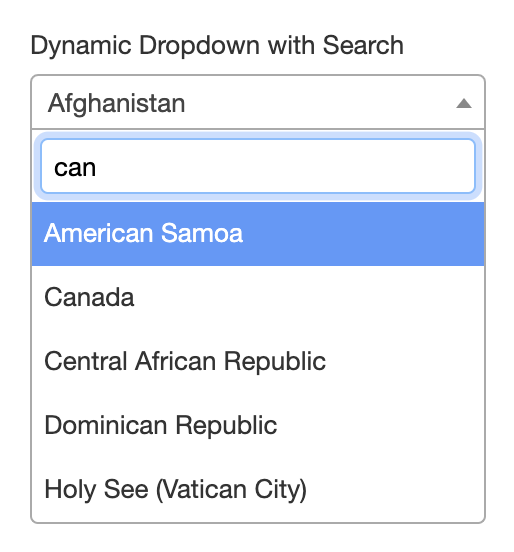
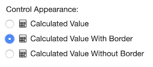
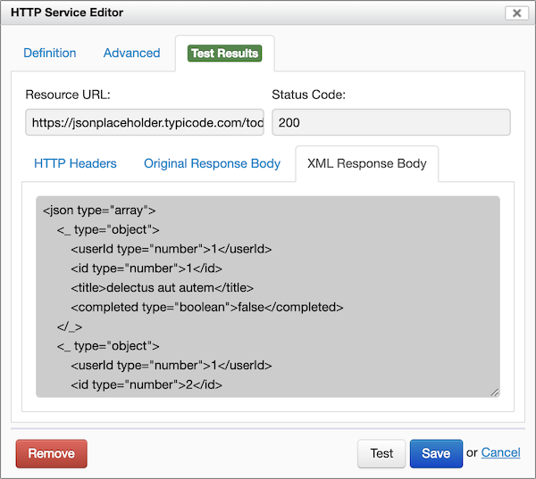
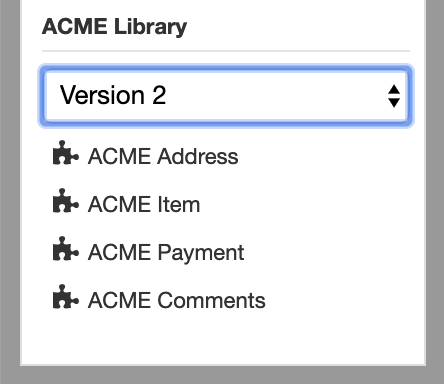

# Orbeon Forms 2019.1

Today we released Orbeon Forms 2019.1! This release is packed with new features and enhancements which should help form authors and form users be more productive.  

## Major features and enhancement

### Controlling non-repeated grid settings

You can now control whether a non-repeated grid is _readonly_ or _visible_, as was the case already for repeated grids or sections (repeated or not). In fact, all the repeated grid settings are now available for non-repeated grids, including:

- Page break before
- Custom CSS classes
- Visibility and Read-Only formulas


As was already the case for sections, you can make a non-repeated grid repeated by enabling the "Repeat Content" checkbox, and vice versa.

The internal data format has been upgraded. See further below for compatibility notes. The external data format is unchanged by default.

### Renaming of control references in formulas

Several constructs in a form can depend on one or more form controls. This includes:  

- "Calculated Value", "Initial", "Visibility", "Read-Only", and "Constraint" formulas
- dynamic label, hint, help, and email templates
- action requests and results

In this version, when a form control, section, or grid is renamed, formulas, templates, and actions are all automatically adjusted.


### Improved selection dropdowns

The "Autocomplete" control is deprecated and replaced with new options for the "Static Dropdown" and "Dynamic Dropdown" controls. You can now, for each of these controls, select a "With Search" option, which allows the user to type in a search box to restrict the number of entries in the dropdown before selecting one.  

<!--  -->

<!--  -->

<figure>
    
</figure>


For more details, see the [documentation](/form-runner/component/static-dynamic-dropdown.md).

### Moving grids up and down among grids and sections

Until now you could move sections up and down, as well as inside and outside of other sections, but you couldn't do the same with grids. Now you can and arrows show next to grids as well.  


### Appearance of calculated values

Since Orbeon Forms 2018.2, "Calculated Value" fields show as gray fields by default. The reasons for this include better visibility and accessibility.  
  This version makes further improvements to this change of appearance, as many users use "Calculated Value" fields not just as calculated values, but as a way to output text in various circumstances. We added:  

- an option to allow choosing "Calculated Value" fields with a border ("full") or without a border ("minimal"). This change is also available with [Orbeon Forms 2018.2.3](https://blog.orbeon.com/2019/05/orbeon-forms-201823-pe.html).
- a global setting to allow changing the default across the board. By default, the global setting is configured to follow backward compatibility. This change has been made available to Orbeon Forms 2018.2.4. Forms use the following default:
    - _Prior to_ Orbeon Forms 2018.2: "minimal" appearance.
    - _Starting with_ Orbeon Forms 2018.2: "full" appearance.

In general, we recommend using the "Explanatory Text" control to present some text to the user. Since this version, note that the "Explanatory Text" can also be dynamic with the support for templates (further on this below).  



### Paging large repeated sections

This version introduces an improvement to [synchronized master-detail views](https://blog.orbeon.com/2019/01/synchronized-master-detail-views.html): it allows each individual detail to show on a separate wizard page. This makes it easier for the user as there is less information presented on each wizard page. In addition, you can configure a custom repetition label for use by the wizard's table of contents.  
    


For more, see the [blog post](https://blog.orbeon.com/2019/09/paging-large-repeated-sections.html) and the documentation:  

- [Paging large repeated sections (wizard)](/form-runner/feature/wizard-view.md#paging-large-repeated-sections)
- [Paging large repeated sections (synchronization)](/form-builder/synchronize-repeated-content.md)
- [Dynamic iteration label](/form-builder/section-settings.md#dynamic-iteration-label)

### HTTP service editor XML preview for JSON

When the service response is in JSON format, you can view the JSON response translated into XML. This is useful when you want to use XPath expressions to access a JSON response, for example with datasets or item choices. ([doc](/form-builder/http-services.md#xml-view-of-json-responses))

  

### Ability to pick a specific section templates library version

When versioning is available, Form Builder allows you to publish multiple versions of a section templates library. Now, Form Builder allows you to select which version of a section templates library you want to use in a particular form definition. ([doc](/form-builder/section-templates.md#versioning-of-section-templates))  



### Improvements to the action syntax

The new [action syntax](/form-builder/actions-syntax.md) has a number of improvements:  

- Iterating over data, including calling services multiple times ([doc](/form-builder/actions-syntax.md#iterating-over-data))
- Conditions ([doc](/form-builder/actions-syntax.md#conditions))
- Improved error handling ([doc](/form-builder/actions-syntax.md#error-handling))
- New actions
    - Calling a process ([doc](/form-builder/actions-syntax.md#calling-a-process))
    - Navigating to a page or URL ([doc](/form-builder/actions-syntax.md#navigating-to-a-page-or-url))
    - Setting the value of an attachment control ([doc](/form-builder/actions-syntax.md#setting-the-value-of-an-attachment-control))
    - Setting the filename of an attachment control ([doc](/form-builder/actions-syntax.md#setting-the-filename-of-an-attachment-control))
    - Setting the mediatype of an attachment control ([doc](/form-builder/actions-syntax.md#setting-the-mediatype-of-an-attachment-control))

### Encryption for attachments

Field-level encryption now also works with file attachments, so, should you choose to, you can have attachments encrypted at rest. ([doc](/form-builder/field-level-encryption.md))

## Other features and enhancements

Including the features and enhancements above, we [closed over 180 issues](https://github.com/orbeon/orbeon-forms/issues?page=7&q=is%3Aissue+is%3Aclosed+project%3Aorbeon%2Forbeon-forms%2F11) since [Orbeon Forms 2018.2](https://blog.orbeon.com/2018/09/orbeon-forms-20181.html).

### Form Builder

- Repeated grids and sections have the following new options:
    - allow or disallow the user to add, remove, or move repetitions ([doc](/form-builder/repeat-settings.md#allow-the-user-to-add-remove-or-move-repetitions))
    - enable or disable the simplified appearance ([doc](/form-builder/repeat-settings.md#simplified-appearance))
- The "Explanation Text" control supports templates. ([doc](form-builder/template-syntax.md))

### Form Runner

- You can now include inline CSS in emails to help format HTML emails. ([doc](/configuration/properties/form-runner-email.md#styling-html-emails))
- The date picker supports keyboard navigation.
- New functions are added:
    - `xxf:formatted-value()` ([doc](/xforms/xpath/extension-controls.md#xxf-formatted-value))
    - `fr:wizard-current-page-name()` ([doc](/xforms/xpath/extension-form-runner.md#fr-wizard-current-page-name))
- A new option allows showing alerts in view and PDF modes. ([doc](/configuration/properties/form-runner-detail-page.md#showing-alerts-in-view-and-pdf-modes))
- Orbeon Forms performs expired and idle connections checking, which can improve the reliability of connections to remote servers. ([doc](/configuration/properties/general.md#expired-and-idle-connections))
- XBL components feature improvements, including:
    - external value serialization/deserialization ([doc](/xforms/xbl/javascript.md#external-value-serialization-deserialization))
    - formatted values ([doc](/xforms/xbl/modes.md#formatted-value))
    - fine-grained custom label/help/hint/alert support ([doc](/xforms/xbl/modes.md#the-lhha-and-custom-lhha-modes))
- A subset of the XForms 2 URI functions is available. ([doc](/xforms/xforms-2-0.md#orbeon-forms-2019-1))

### XForms

- In this version, we have optimized the way the creation of new repeated items works.
- We added the ability to receive binary content. ([doc](/xforms/submission-extensions.md#receiving-binary-content))
- We support the `target` attribute on `<xf:load>`. ([doc](https://doc.orbeon.com/xforms/core/xforms-2-0))

### Platform

- Orbeon Forms is now supported on Java 11.
- The Orbeon Forms proxy portlet is now supported with  Liferay 7.1.3 GA4.

### Internationalization

With this version, a new Danish localization is available thanks to a kind contributor!  

See also:  

*   [Supported languages](/form-runner/feature/supported-languages.md) for the list of supported languages.
*   [Localizing Orbeon Forms](/contributors/localizing-orbeon-forms.md) for information about how to localize Form Builder and Form runner in additional languages. Localization depends on volunteers, so please let us know if you want to help!

## Browser support

- **Form Builder (creating forms)**
    - Chrome 77 (latest stable version)
    - Firefox 70 (latest stable version) and the current [Firefox ESR](http://www.mozilla.org/en-US/firefox/organizations/faq/)
    - Microsoft Edge 17 and 18
    - Safari 13 (latest stable version)
- **Form Runner (accessing form)**
    - All browsers supported by Form Builder (see above)
    - IE11, Edge 15 and Edge 16
    - Safari Mobile on iOS 13
    - Chrome for Android (stable channel)

## Compatibility notes

### Autocomplete control

The "Autocomplete" control is deprecated. See "Improved selection dropdowns" above for details. At this time, the "Autocomplete" is still supported but we recommend using the newer controls instead. See also the [documentation](/form-runner/component/static-dynamic-dropdown.md).

### eXist deprecations

Support for the [eXist](https://exist-db.org/) database is deprecated. We recommend using an external [relational database](/form-runner/persistence/relational-db.md) instead. This means that:

- We don't recommend using eXist for production.
- We don't plan for ad new features that target eXist.
- As of Orbeon Forms 2019.1, eXist is still used for demo forms.

### Internal data format

The _internal data format_ for non-repeated grids has been upgraded (in the same way that it was upgraded for Orbeon Forms 4.8). This doesn't change the default data format in the database unless you explicitly change that: the Orbeon Forms 4.0.0 format remains the default.  

However, if your forms use formulas or custom XForms which depend on the internal data format, you might need to make adjustments. Specifically, if you use XPath expressions that assume that controls within a grid don't have an enclosing element, you will need to update these expressions.

For details, see the documentation on [form data and data formats](/form-runner/data-format/form-data.md).

### Date, time and date/time output formats

The date, time, and date/time output formats have changed to match the input formats as this was a frequently-mentioned inconsistency. This impacts the review and PDF modes, and the formatting of values in emails. For example, previously a date/time would show "Friday October 16, 2009 17:48:03" in review and PDF modes. Now it shows "10/16/2009 5:48:03 pm" like for the input format.  

You can easily restore the old formats by adding the following to your properties-local.xml file:  

```xml
<property as="xs:string"  name="oxf.xforms.format.output.date">  
    if (. castable as xs:date) then format-date(xs:date(.), '[FNn] [MNn] [D], [Y]', xxf:lang(), (), ()) else .  
</property>  
<property as="xs:string"  name="oxf.xforms.format.output.dateTime">  
    if (. castable as xs:dateTime) then format-dateTime(xs:dateTime(.), '[FNn] [MNn] [D], [Y] [H01]:[m01]:[s01]', xxf:lang(), (), ()) else .  
</property>  
<property as="xs:string"  name="oxf.xforms.format.output.time">  
    if (. castable as xs:time) then format-time(xs:time(.), '[H01]:[m01]:[s01]', xxf:lang(), (), ()) else .  
</property>
```  

### JavaScript placement at the bottom

The `oxf.xforms.resources.javascript-at-bottom` property, deprecated with Orbeon Forms 2018.1, no longer has any effect. ([doc](/configuration/advanced/javascript-css-assets.md#javascript-at-the-bottom-of-the-page))

### Removal of oxf.xforms.update-repeats option

The `oxf.xforms.update-repeats` option, deprecated with Orbeon Forms 2018.1, is now removed. ([doc](/configuration/properties/xforms.md#xforms-repeat-updates-upon-xf-insert-and-xf-delete))

## Download and feedback

You can download the latest version of Orbeon Forms from the [downloads](https://www.orbeon.com/download) page.  

Don't forget to [grab a trial license](https://prod.orbeon.com/prod/fr/orbeon/register/new) for the PE version.  

Please send feedback:  

- via [Twitter](http://twitter.com/orbeon)
- to the [discussion](http://www.orbeon.com/community) list

We hope you enjoy this release!
