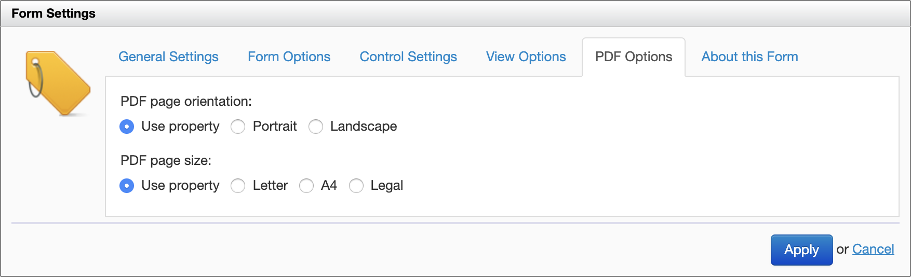
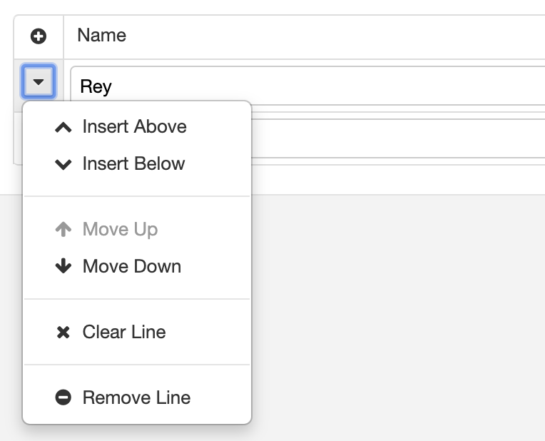

# Orbeon Forms 2019.2

__Monday, December 30, 2019__

Today we released Orbeon Forms 2019.2! This release introduces some new features and bug-fixes.  

## Notable features and enhancement

### Landscape mode support

You can now set the PDF page size and orientation (portrait or landscape) with the Form Builder Form Settings or with configuration properties.

For details, see the [blog post](https://blog.orbeon.com/2019/11/new-layout-choices-for-pdf-and-browser.html).

### Fluid layout support

You can now opt for a *fluid* form width, where the form takes all the width available in the browser window. This works with or without the wizard view, as well as in the view mode. Form Builder also shows the form being edited with a fluid width, which makes it easier to edit forms that require a wider view.

For details, see the [blog post](https://blog.orbeon.com/2019/11/new-layout-choices-for-pdf-and-browser.html) and [documentation](https://doc.orbeon.com/form-builder/form-settings).

### Date support for Excel import 

The [Excel import](/form-runner/advanced/excel.md) now supports importing date and time formats. Cells that contain values formatted as date/time, date, or time in the Excel spreadsheet are automatically converted to their respective ISO formats before being stored as form data.

See also the [documentation](https://doc.orbeon.com/form-runner/advanced/excel#handling-dates-and-times). 

### Clearing all fields in a repetition

Repeated grids and sections support a [menu](https://doc.orbeon.com/form-runner/component/grid#menu) allowing inserting, moving and removing repetitions.

This release adds the new option of *clearing* (or *resetting*) a repetition. When this option is activated, all data entered by the user in the repetition is cleared and all default values for the repetition are set.

## Other features and enhancements

Including the features and enhancements above, we [closed over 180 issues](https://github.com/orbeon/orbeon-forms/issues?page=7&q=is%3Aissue+is%3Aclosed+project%3Aorbeon%2Forbeon-forms%2F11) since [Orbeon Forms 2019.1](orbeon-forms-2019.1.md).

- New features
    - Ability for "new" button on summary page to always use the latest version of the form ([doc](https://doc.orbeon.com/configuration/properties/form-runner/form-runner-summary-page#new-button-version-of-the-form))
    - Ability for form authors and admins to reload resources for a form, instead of restarting the server ([doc](https://doc.orbeon.com/form-runner/features/home-page#reloading-resources))
    - Issues with nested `<fr:data-iterate>` ([doc](https://doc.orbeon.com/form-builder/advanced/services-and-actions/actions-syntax#nesting-of-iterations))
    - JavaScript API to obtain the data status ([doc](https://doc.orbeon.com/form-runner/advanced/client-side-javascript-api#telling-whether-the-form-data-is-safe))
    - Ability to pass headers to the `send()` action ([doc](https://doc.orbeon.com/form-runner/advanced/buttons-and-processes/actions-form-runner/actions-form-runner-send#using-parameters))
    - Font embedding: support path relative to resources ([doc](https://doc.orbeon.com/form-builder/advanced/pdf-production/pdf-automatic))
    - New low-level [`assets.baseline.updates` property](/configuration/advanced/javascript-css-assets.md#baseline-of-xforms-assets)
- Other fixes and enhancements
    - Allow clearing the value of drodpowns with search ([\#4240](https://github.com/orbeon/orbeon-forms/issues/4240))
    - Lower-level `reset-form-data` action ([\#4221](https://github.com/orbeon/orbeon-forms/issues/4221))
    - Consider making closed sections load lazily ([\#4271](https://github.com/orbeon/orbeon-forms/issues/4271))
    - Handwritten signature doesn't work with Java embedding API ([\#4275](https://github.com/orbeon/orbeon-forms/issues/4275))
    - PDF Template: time field doesn't work ([\#4272](https://github.com/orbeon/orbeon-forms/issues/4272))
    - Show messages about existing documents inline, instead of using dialogs ([\#4263](https://github.com/orbeon/orbeon-forms/issues/4263))
    - Fields date looks bad ([\#4199](https://github.com/orbeon/orbeon-forms/issues/4199))
    - Keep respective order of `javascript:` loads and other scripts ([\#4261](https://github.com/orbeon/orbeon-forms/issues/4261))
    - Help icon not showing after adding help message ([\#4291](https://github.com/orbeon/orbeon-forms/issues/4291))
    - Large form is slow in Form Builder in part due to `createTemplateContentFromBindName` ([\#4268](https://github.com/orbeon/orbeon-forms/issues/4268))
    - Don't set the focus on the first field on page load on mobile ([\#4219](https://github.com/orbeon/orbeon-forms/issues/4219))
    - Actions Editor to use dropdown with search to select controls ([\#4215](https://github.com/orbeon/orbeon-forms/issues/4215))
    - Wizard: navigate pages with the keyboard ([\#4210](https://github.com/orbeon/orbeon-forms/issues/4210))
    - Mark wizard navigation as ARIA navigable ([\#4301](https://github.com/orbeon/orbeon-forms/issues/4301))
    - Migrate from YUI Connection to the Fetch API ([blog post](https://blog.orbeon.com/2019/12/keeping-our-code-current.html))
    - refactoring and library upgrades

## Internationalization

See also:  

*   [Supported languages](/form-runner/feature/supported-languages.md) for the list of supported languages.
*   [Localizing Orbeon Forms](/contributors/localizing-orbeon-forms.md) for information about how to localize Form Builder and Form runner in additional languages. Localization depends on volunteers, so please let us know if you want to help!

## Browser support

- **Form Builder (creating forms)**
    - Chrome 79 (latest stable version)
    - Firefox 71 (latest stable version) and the current [Firefox ESR](https://www.mozilla.org/en-US/firefox/enterprise/)
    - Microsoft Edge 17 and 18
    - Safari 13 (latest stable version)
- **Form Runner (accessing form)**
    - All browsers supported by Form Builder (see above)
    - IE11, Edge 15 and Edge 16
    - Safari Mobile on iOS 13
    - Chrome for Android (stable channel)

## Compatibility notes

### Removal of short namespaces support for the proxy portlet

This was disabled by default since 2017.2.3 and 2018.1. See the [documentation](/form-runner/link-embed/liferay-proxy-portlet.md).

There should be no impact unless you have client-side code which specifically looks for hardcoded short prefixes.

### Removed properties

The following properties are removed:

- `oxf.xforms.client.events.filter`: this was deprecated since Orbeon Forms 4.5.
- `oxf.xforms.client.events.mode`: specifically, the `deferred` mode is removed.
- `oxf.xforms.cache-combined-resources`: HTTP reverse proxies can cache resources without having access to a file on disk, which makes this feature obsolete.

Before upgrading, check whether your `properties-local.xml` contains these properties. It is unlikely, but if it does, and the properties are not blank or with a default value, please ask Orbeon for advice.

### Custom CSS for PDF page size and orientation

In the past, if you wanted a specific PDF page orientation or size, you had to use custom CSS.

Instead, we now recommend using Form Builder settings and/or configuration properties. See [Landscape mode support](#landscape-mode-support) above for details. 

### Removal of `oxf:url-serializer`

This low-level XML processor was rarely used and is now removed. 

## Download and feedback

You can download the latest version of Orbeon Forms from the [downloads](https://www.orbeon.com/download) page.  

Don't forget to [grab a trial license](https://prod.orbeon.com/prod/fr/orbeon/register/new) for the PE version.

Please send feedback via [Twitter](https://twitter.com/orbeon) or the [forum](https://www.orbeon.com/community).

We hope you enjoy this release!
