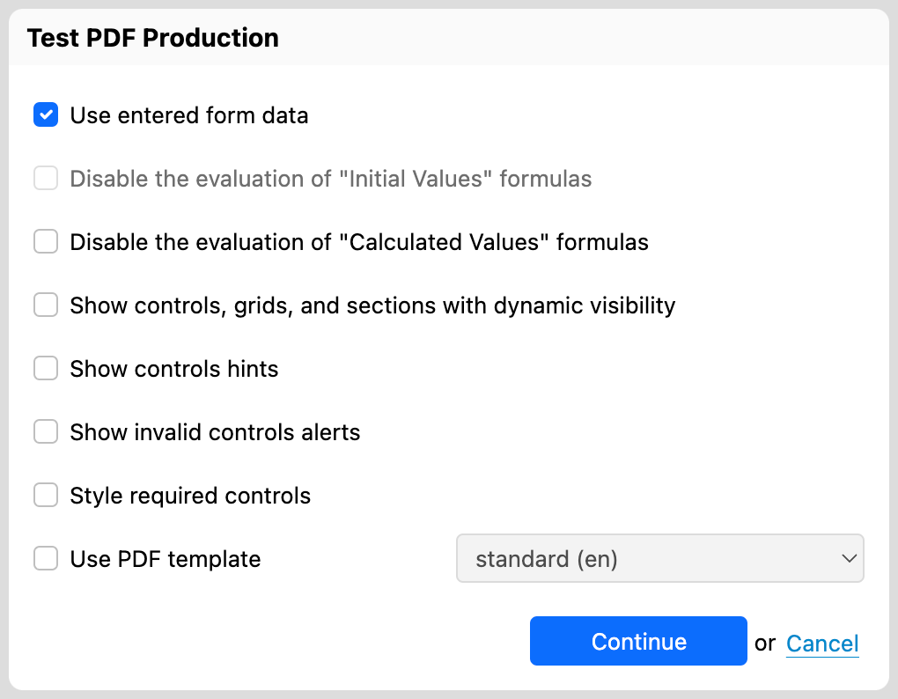
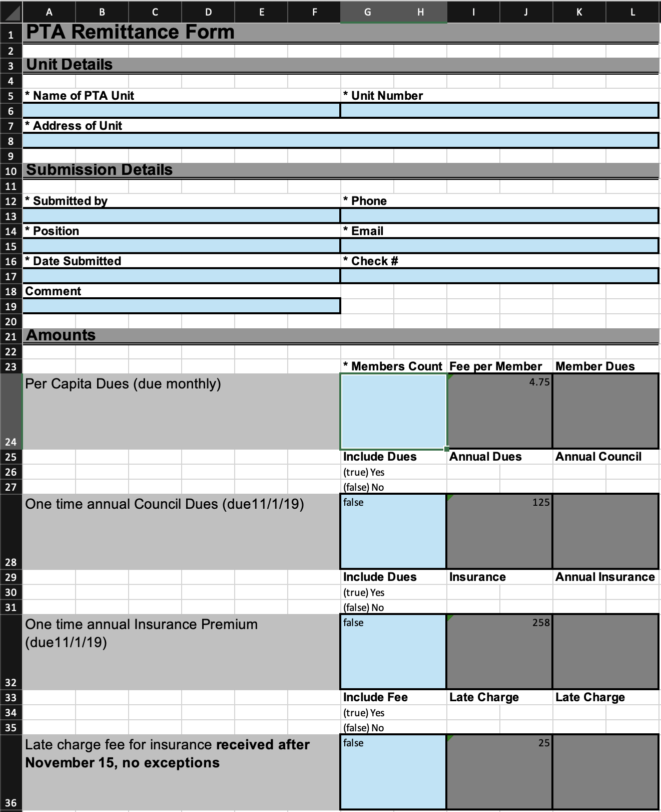
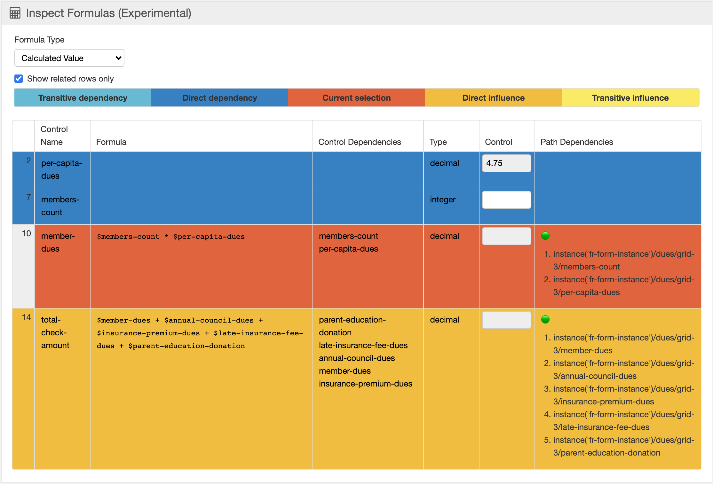
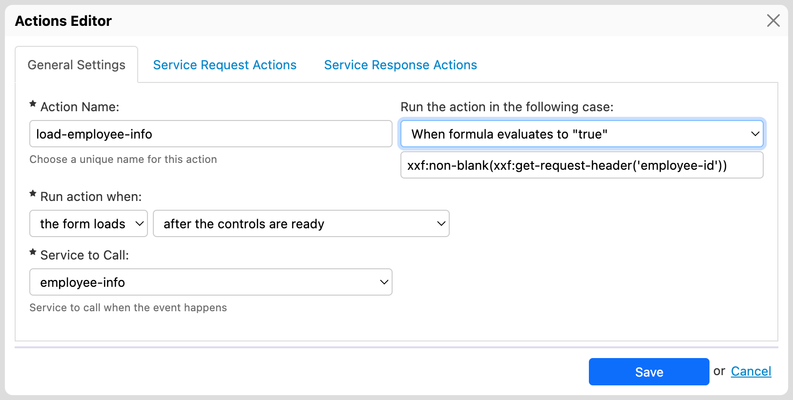
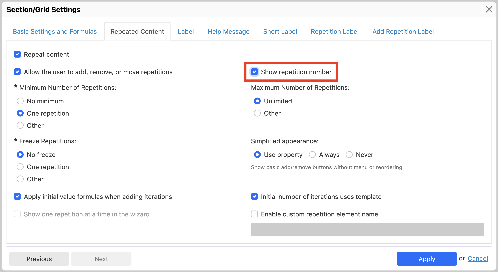
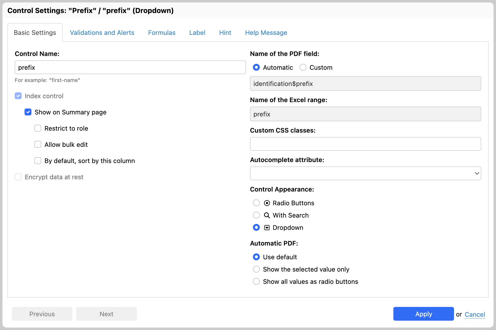
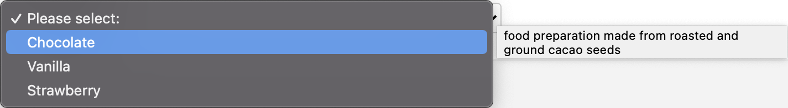
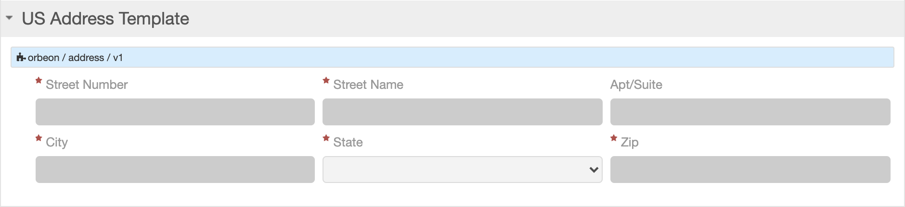

# Orbeon Forms 2021.1

**Friday, December 31, 2021**

Today we released Orbeon Forms 2021.1! This release introduces new features and bug-fixes.

## Notable features and enhancement

### Ability to test PDF production

Orbeon Forms 2021.1 allows you to test PDF production without publishing your form.

This feature provides a number of options that help test some of the form's logic as well:

For more details:

* [blog post](https://blog.orbeon.com/2021/11/testing-pdf-production-in-form-builder.html)
* [documentation](https://doc.orbeon.com/form-builder/advanced/pdf-production/pdf-test)

### Quick control search

In large forms, it is often difficult to navigate to a specific form control. Orbeon Forms 2021.1 introduces a quick way to find a control using one of the following keyboard shortcuts:

* ⌘J (macOS)
* ⌃J (other operating systems)

The shortcuts open a small dialog. Clicking or pressing the Enter key and then typing a search term allows you to search from the list of available controls. Upon selection, Form Builder highlights and scrolls to the control selected.

If the "Open Settings Dialog" option is selected, the "Control Settings" dialog for the control also opens right away.

For details, see [Quick control search](../form-builder/quick-control-search.md).

### Excel export and import

Orbeon Forms 2021.1 includes a new feature to import and export Excel files.

Previous Orbeon Forms versions already supported an Excel import feature. Here are the main differences between the two types of Excel imports:

| Existing import feature                   | New import feature          |
| ----------------------------------------- | --------------------------- |
| multiple form documents at a time (batch) | one form document at a time |
| row and column-based                      | named range based           |
| no repeat support                         | repeat support              |
| fixed layout                              | customizable layout         |

The new document-based import feature does not replace the previous one but complements it. Each feature might be improved in the future.

The export feature produces Excel files that look like this:

For more details:

* [import documentation](../form-runner/feature/excel-xml-import.md)
* [export documentation](../form-runner/feature/excel-xml-export.md)
* [blog post](https://blog.orbeon.com/2021/09/excel-export-and-import.html)

### XML format for export and import

Similarly to the import and export of Excel files, Orbeon Forms 2021.1 allows you to export form data and description to an XML file, and to reimport the data back.

Orbeon Forms internally represents form data as XML. However, this import/export feature doesn't directly export that data. It exports:

* export metadata (export date, etc.)
* metadata about the form (title, etc.): `<form-metadata>` element
* information about the structure of the form, including sections, grids, their labels, and more: `<form-structure>` element
* the data proper, but only data that is not always hidden: `<form-data>` element

Here is [an example](https://gist.github.com/orbeon/99d75c9f624d68db07493ae508540de3) of XML export.

### Experimental offline mode

Since its inception, Orbeon Forms has had a hybrid architecture for forms:

* the user interface runs in the browser, implemented in JavaScript (and more recently Scala.js)
* the form's logic and validations runs on the server

This architecture has benefits, such as protecting the confidentiality of internal data that never leaves the server.

This is still the case with the Orbeon Forms 2021.1, however we made lots of internal changes to support running Form Runner in a pure JavaScript environment. This will, in the future, allow running forms entirely offline, as well as embedded within mobile apps.

With Orbeon Forms 2021.1, we are releasing a preview of this feature. From Form Builder, simply use the new "Test Offline" button to see whether your form operates and renders properly in this new mode.

When you do this:

* The form definition edited in Form Builder is compiled to a serialized representation.
* The JavaScript-based form runtime is loaded in the Form Builder test window, loads the compiled form, and renders it.

From the user's perspective, this works almost exactly like the "Test" button which has always been present in Form Builder.

As of Orbeon Forms 2021.1, there are limitations, including the following:

* The APIs to compile and embed forms are not yet documented.
* Some controls are not fully supported, including the Formatted Text Area as well as attachment controls.
* Some formulas might not work.
* Performance needs some improvements.
* There is no XML Schema support for datatype validation (although this is rarely used).

For details, see [Offline test](/form-builder/offline-test.md).

### Inspection of formulas

With Orbeon Forms, formulas are very important: they are used for calculating values, making parts of the form visible or readonly, and more. However, they can be difficult to debug, and so far Form Builder didn't have a way to show all formulas in a central location.

A new, still experimental feature allows you to inspect formulas. You access it under the "Test" menu.

This allows you to see, in a table, the following formulas used in the form for:

* Initial Value
* Calculated Value
* Visibility
* Required
* Read-Only

The following example show dependencies between "Calculated Value" formulas and controls. A color scheme indicates the dependency relationships between controls via formulas.

We consider this features still experimental, but only because it is still fairly basic! However, it is still useful and we hope to improve it in newer versions of Orbeon Forms.

For details, see [Formulas inspector](../form-builder/formulas-inspector.md).

### Actions Editor improvements

The Actions Editor features two new enhancements:

* You can now set service values from a formula in addition to a control value.
* You can control whether an action runs based on formula.

These two features were already supported by the [Action Syntax](../form-builder/actions-syntax.md) but were not available in the Form Builder UI.

For more details:

* [Passing a value from a formula](../form-builder/actions.md#passing-a-value-from-a-formula)
* [Basic action configuration](../form-builder/actions.md#basic-action-configuration)
* [Blog post](https://blog.orbeon.com/2021/10/enhancements-actions-editor-2021-1.html)

### Grids

Orbeon Forms 2021.1 improves grids in two ways.

First, the Grid Settings dialog now shows the number of grid rows in the grid.

Second, for repeated grids only, an option allows you to automatically show a row number at the beginning of each grid repetition.

For more details:

* [blog post](https://blog.orbeon.com/2021/09/enhancements-to-repeated-grids.html)

## Other

### Option to index fields separately from Summary page

Until now, Orbeon Forms would index fields marked as "Show on Summary page" or "Allow bulk edit" in the "Control Settings" dialog.

It is now possible to tell Form Runner to index fields independently of whether they show in the Summary page. This allows indexed fields to be searchable via the [Search API](../form-runner/api/persistence/search.md).

For details, see [Control Settings](../form-builder/control-settings.md#main-options).

### Double-precision floating-point type

The double-precision floating-point type was removed with Orbeon Forms 2016.1 (see the [blog post](https://blog.orbeon.com/2016/01/removing-double-datatype.html)) from the list of selectable types in the "Control Settings" dialog. The reason for this was that for the vast majority of cases, this is not the appropriate type (but "Integer" or "Decimal" are), and users would often select the incorrect type and then get rounding errors in fields such as the Currency field.

However, for scientific calculations, a floating-point type is appropriate. For this reason, we have reintroduced this type in the list of available types. This said, we recommend its use only in very specific circumstances.

For details, see [Control Settings](../form-builder/validation.md#data-type-validation).

### Hints for dropdown control choices

Hints were already supported, among selection controls, on "Radio Buttons" and "Checkboxes" controls. They are now used on the "Static Dropdown" as well. This allows browsers to show hints when the user hovers over an entry. Screen readers also read the hint, represented as a `title` attribute in HTML.

This also works with the "Dropdown with Search" control.

### Option to show all dropdown control values in automatic PDF

When producing a PDF file, single-selection controls like the "Static Dropdown" normally just output the selected value. However, in some cases, it is useful for the user to see all the available options. You can now achieve this with a new option in the "Control Settings" dialog for single-selection controls. This option is hierarchical: you can set it at the field level, form level, or globally.

For more, see [Automatic PDF options](../form-builder/control-settings.md#automatic-pdf-options).

### More fine-grained control over calculations

Sometimes calculations should not run in readonly modes, such as the View page. This can now be configured at the form level.

For more, see:

* [Form Settings](../form-builder/form-settings.md#formulas)
* the [`oxf.fr.detail.readonly.disable-calculate` property](../configuration/properties/form-runner-detail-page.md#calculations-in-readonly-modes)

### XForms 2.0 support

Underlying Orbeon Forms lies an XForms processor. We have added two features from the XForms 2.0 specification:

* the `xforms-dialog-shown`/`xforms-dialog-hidden` events
* the `xf:parse()` function

### Accessibility

We regularly make enhancements to accessibility. In this version:

* The Error Summary now announces new error messages.
* We avoid invalid `role="navigation"` on `<ul>` elements.
* We improved reading of labels for "Date and Time" controls.

### New XPath functions

The following new XPath functions were added:

* [`fr:is-embedded()`](../xforms/xpath/extension-form-runner.md#fr-is-embedded): tells whether the form is embedded
* [`fr:is-background()`](../xforms/xpath/extension-form-runner.md#fr-is-background): tells whether the form is running in the background
* [`fr:is-draft()`](../xforms/xpath/extension-form-runner.md#fr-is-draft): tells whether the user is currently editing a draft

In addition, the [`fr:control-string-value()`](../xforms/xpath/extension-form-runner.md#fr-control-string-value) and [`fr:control-typed-value()`](../xforms/xpath/extension-form-runner.md#fr-control-typed-value) support a new argument to take a library name. This allows accessing control values from section templates.

### API improvements

The [Form Metadata API](form-runner/api/persistence/forms-metadata.md) now has the ability to filter by `modified-since` date.

The [Run form in the background API](../form-runner/api/other/run-form-background.md) supports the following new parameters:

* `disable-default=true`: disable the evaluation of initial values
* `disable-calculate=true`: disable the evaluation of calculated values
* `disable-relevant=true`: disable the evaluation of visibility values

The same API now supports [returning form data](../form-runner/api/other/run-form-background.md#returning-form-data).

The [Search API](form-runner/api/persistence/search.md) returns new metadata for each form definition:

* `created-by`
* `created-by-groupname`
* `last-modified-by`

The XML Schema API allows [selecting the data format](../form-runner/api/other/xml-schema-generation.md#data-format-version) for which to produce the XML Schema.

The CRUD API supports [migrating a form definition for integration purposes](../form-runner/api/persistence/crud.md#migrating-a-form-definition-for-integration-purposes).

### Process actions

The `send` action supports [passing the current workflow stage](../form-runner/advanced/buttons-and-processes/actions-form-runner-send.md#url-format).

The `error-message()` process action supports [a new `appearance` parameter](../form-runner/advanced/buttons-and-processes/actions-form-runner.md#success-message-and-error-message).

Low-level `xf:insert` and `xf:delete` actions are now available in processes.

### Misc

The [`oxf.fr.detail.warn-when-data-unsafe` property](../configuration/properties/form-runner-detail-page.md#warning-the-user-when-data-is-unsafe) supports a formula (AVT).

The `oxf.http.ssl.keystore` properties can point to resources within Orbeon Forms (`oxf:` protocol). The handling of the keystore vs. the trustore has been clarified. See the [documentation](../configuration/properties/properties-general-http-client.md#2-way-ssl).

### Flat view to support form versions

The [Flat view](../form-runner/persistence/flat-view.md) now supports form definition versions.

### Home page improvements

The [Home page](../form-runner/feature/forms-admin-page.md) now supports completely deleting a published form definition. Until now, you could mark a form definition as unavailable, but not delete it completely.

_NOTE: For_ [_auditing_](../form-runner/persistence/auditing.md) _purposes, deleted form definitions are still present in the database unless explicitly removed there._

You can configure an [explicit timezone](../configuration/properties/form-runner.md#timezone) for creation and last modification timestamps.

The [Home page](../form-runner/feature/published-forms-page.md) now lists published form definitions by application name, form name, and (which is new), by version number. This allows all operations to work on a specific form definition version.

### Summary page improvements

The [Summary page](../configuration/properties/form-runner-summary-page.md) can be configured to show the "created by" and "last modified by" users with the following properties:

* `oxf.fr.summary.show-created-by`
* `oxf.fr.summary.show-last-modified-by`

You can configure an [explicit timezone](../configuration/properties/form-runner.md#timezone) for creation and last modification timestamps.

### Section templates improvements

Form Builder now shows the library/section names and version at the top of the section at design-time.

See also [Section template](../form-builder/section-templates.md).

We added initial support for allowing section templates from the same library to communicate via actions. This in particular allows an action triggered by an event in a given section to update form controls in another section, if these two sections are included in the same destination form.

### Filter to log the body of incoming requests

See the [documentation](../form-runner/advanced/monitoring-http-requests.md##orbeon-forms-httploggingfilter).

## Internationalization

See also:

* [Supported languages](../form-runner/feature/supported-languages.md) for the list of supported languages.
* [Localizing Orbeon Forms](../contributors/localizing-orbeon-forms.md) for information about how to localize Form Builder and Form runner in additional languages. Localization depends on volunteers, so please let us know if you want to help!

## Browser support

* **Form Builder (creating forms)**
  * Chrome 97 (latest stable version)
  * Firefox 95 (latest stable version) and the current [Firefox ESR](https://www.mozilla.org/en-US/firefox/enterprise/)
  * Microsoft Edge 98 (latest stable version)
  * Safari 15.1 (latest stable version)
* **Form Runner (accessing form)**
  * All browsers supported by Form Builder (see above)
  * IE11, Edge 18
    * NOTE: IE11 support is now deprecated.
  * Safari Mobile on iOS 15
  * Chrome for Android (stable channel)

## Compatibility notes

### Log4j2

Due to December 2021 Log4j vulnerabilities, Orbeon Forms now uses the latest Log4j 2.x libraries. Until Orbeon Forms 2020.1.5, Orbeon Forms used older Log4j 1.x libraries. While Orbeon Forms was not vulnerable to these specific attacks, we decided to migrate Orbeon Forms to Log4j 2.x in order to respond faster to future vulnerabilities should they arise.

For details, see the following blog posts;

* [Vulnerability in the log4j library](https://blog.orbeon.com/2021/12/vulnerability-in-log4j-library.html)
* [Orbeon Forms PE Log4j maintenance releases](https://blog.orbeon.com/2021/12/orbeon-forms-pe-log4j-maintenance.html)
* [More Orbeon Forms PE Log4j maintenance releases](https://blog.orbeon.com/2021/12/more-orbeon-forms-pe-log4j-maintenance.html)

Log4j 2.x uses different configuration files than Log4j 1.x. However, we provide backward compatibility support for the older Log4j 1.x configuration file. This means that in most cases, you do not have to update your configuration file immediately.

Orbeon Forms no longer ships with a `log4j.xml` configuration file, but it ships with a `log4j2.xml` configuration file.

* If you have pre-existing `log4j.xml` configuration file, for example because you are upgrading to Orbeon Forms 2021.1 from an older version, you can still use that configuration file, which will take precedence over the new `log4j2.xml` file. However:
  * You must make sure that you do not have duplicate log file names in the configuration, or Log4j 2.x will complain about that and ignore the configuration.
  * We recommend that you consider moving to a `log4j2.xml` configuration file.
* If you do not yet have an existing `log4j.xml` file:
  * We recommend that you update the `log4j2.xml` configuration file that ships with Orbeon Forms.

If you are creating or updating a `log4j2.xml` file, you cannot simply copy the contents of an existing `log4j.xml` to `log4j2.xml` as the two formats are incompatible! Instead, start with the `log4j2.xml` provided, and visit the [Log4j 2 configuration](https://logging.apache.org/log4j/2.x/manual/configuration.html) online to understand and make changes.

_WARNING: With version of Orbeon Forms that use Log4j 2.x, and whether you are using `log4j.xml` or `log4j2.xml`, you must make sure that you do not have **duplicate log file names in the configuration**, even if some of them are unused, or Log4j 2.x will complain about that and ignore the configuration. Log4j 1.x did not use to consider this an error, but Log4j 2.x does._

For more, see [Logging](../installation/logging.md).

### Combining custom and built-in relational persistence

If you are using the following unlikely combination:

* The built-in implementation of persistence API for relational databases to store forms.
* Your own implementation of the persistence API to store data.

Then, starting with Orbeon Forms 2021.1, your implementation of the persistence API needs to support the `HEAD` method, in addition to `GET`.

### "Save Draft" button

The `save-draft` button is now called `save-progress`. The button label is also renamed to say "Save Progress" instead of "Save Draft" by default. The reason for this renaming is that it reflects the intention better, and reduces confusion with the word "draft" also used for autosave drafts.

The `save-draft` button remains for backward compatibility. By default, it calls the `process("save-progress")` process.

We recommend that you review whether you have customized the `save-draft` process and/or button resources in your `properties-local.xml` and update them to the new name as needed,

### Use of `model` and `xxbl:scope` on `<xf:output>`

xxx