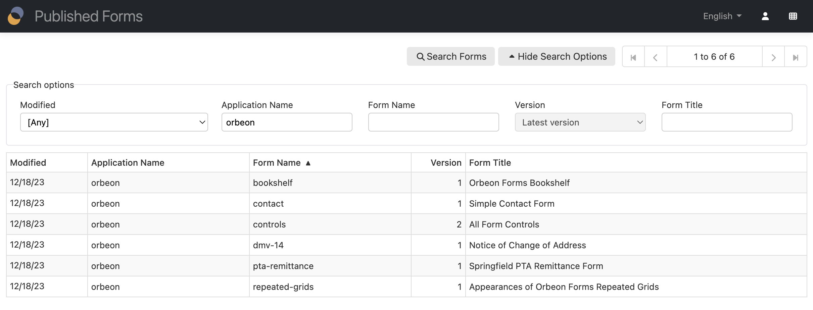

# Orbeon Forms 2022.1

__Saturday, December 31, 2022__

Today we released Orbeon Forms 2022.1! This release is packed with new features and bug-fixes!

## New features

### New Landing page and application navigation

Form Runner now features a new Landing page, organized in cards which provides quick access to:

- Quick links, including Form Builder and the Administration page
- Your published forms
- Your in-progress Form Builder forms
- Demo forms


Some cards directly list content, including the list of published forms and the list of in-progress Form Builder forms.

You can configure whether you want to have a particular card on the Landing page. For example, you can hide the demo forms for production deployment.

All Form Runner and Form Builder navigation bars now provide a direct link to the Landing page. This can be disabled if not desired.


We have made the Summary page layout fluid, similar to the Forms/Admin page (previously known as the Home page).

Finally, Form Runner buttons now are sticky, so that they are always visible when scrolling. This is particularly useful on the Summary and Forms pages, which can display long lists of forms or form data.

### Separation of the Admin page and Home page

Previously, Form Runner featured a static landing page, as well as a Home page, which doubled as an Admin page when the user was an administrator. The Home page is now replaced by a Forms page, which shows published forms accessible to the user, but no administration functions, and a separate Administration page, which is only accessible to administrators.



The Admin page is very similar to the Forms page, but features additional administration functions and shows library forms. 


### Drag and drop of form controls to grid cells

Form Builder has long supported drag and drop of form controls *between* grid cells. This release introduces drag and drop of form controls from the toolbox to grid cells, which is more intuitive to newcomers and also convenient for experienced users. You can still click on toolbox controls to add them to a grid cell as before, but you can now also drag and drop them.


[//]: # (- Form Builder: Drag and Drop of controls to grid cells &#40;[\#5252]&#40;https://github.com/orbeon/orbeon-forms/issues/5252&#41;&#41;)

### Per-app and global permissions configuration

Previously, Form Runner permissions were configured per form. This release introduces the ability to configure permissions per app, as well as globally. This is particularly useful when you have a large number of forms, and want to configure permissions for all of them at once.

Per-app and global permissions are currently set using configuration properties. In the future, we plan to add a UI to configure them. 

See also the [documentation](/form-runner/access-control/deployed-forms.md#per-app-and-global-permissions).

### New _List_ permission

The new _List_ permission allows specifying that the user can list form data on the Form Runner Summary page.

With earlier versions of Orbeon Forms, the ability to "Read" implied the ability to _List_ on the Summary page.


For more details, see the [documentation](/form-runner/access-control/deployed-forms.md#the-_list_-permission).

### Improved look and feel

This version includes lots of improvements to the look and feel of Form Runner and Form Builder, including:

- wide navigation bar
- flat buttons
- use of the system font by default
- lighter background and rounded corners
- more modern dialogs


### Resizing of image attachments

The Image Attachment form control now supports resizing images upon upload. You can configure the maximum width and height of images, and the control will automatically resize images to fit within these dimensions before storing the image in the persistence layer.

You can also choose the resulting image format, which can be PNG or JPEG, and the quality of the JPEG image.


[//]: # (- Image attachment: ability to resize images upon upload &#40;[\#3061]&#40;https://github.com/orbeon/orbeon-forms/issues/3061&#41;&#41;)

### Improved selection on the Summary, Forms, and Admin pages

The Summary, Forms, and Admin pages now support quick selection of multiple form data or published forms. These pages already allowed you to perform operations on one or more rows, such as deleting data, publishing forms, etc. However, you had to check each checkbox individually. We have now implemented two new features that improve on this:

- A menu to quickly select items on the Summary page (the Admin page already had such a menu).
- The ability to “shift-click” checkboxes.

The menu allows you to select all items, or to select only items that match a particular status. For example, you can select only published forms on the Admin page, or only form data that is not an in-progress draft in a form's Summary page. The number of selected items is conveniently displayed in the menu.


If you are familiar with for example Gmail, you might know that you can select a checkbox, and then shift-click another one, and all the checkboxes in the interval will be selected. Similarly, you can deselect a series of checkboxes. The exact logic is a little subtle, but we implemented something very similar in Form Runner.


This doesn’t only apply to the Form Runner Summary, Forms, and Admin pages: it applies to any checkboxes in a repeated grid. And it also applies to the Checkboxes form control, so you can quickly select and deselect a range of checkboxes.

See also:

- Blog post: [Improved selection of multiple items](https://blog.orbeon.com/2023/01/improved-selection-of-multiple-items.html)

### Improved simple data migration

Orbeon Forms 2018.2 introduced [Simple Data Migration](https://doc.orbeon.com/form-runner/features/simple-data-migration) (see also the [original blog post](https://blog.orbeon.com/2018/09/simple-data-migration.html)). This feature allows the form author to make changes to a published form, including adding and removing form fields, grids, and sections, without creating a new form version.

This release introduces a number of improvements to Simple Data Migration. With Orbeon Forms 2022.1, you can move form controls within the form as long as they remain within the same nesting of repeated content, republish the form over the existing version, and things will just work. For example:

- Move controls at the top-level of a form, even across grids and sections.
- Move controls within a given level of repeated grids or repeated sections, even across nested grids.
- Simply moving a form control this way allows you to reorganize your form while keeping access to existing data.


See also:

- Blog post: [Improved simple data migration](https://blog.orbeon.com/2022/09/improved-simple-data-migration.html)

### Multipart support for attachments and more

This release enhances the `send` action with the ability to send multiple items to a service endpoint in a single HTTP request using a so-called multipart request format. This allows sending form data along with its attachments, and even to add a PDF file or an Excel export to that. The configuration is simple as you just specified multiple `content` tokens:

```
send(
    uri     = "https://httpbin.org/anything",
    method  = "POST",
    content = "xml attachments pdf"
)
```

See also:

- Blog post: [Improving the send action with multipart support](https://blog.orbeon.com/2022/10/improving-send-action-with-multipart.html)
- [Documentation](/form-runner/advanced/buttons-and-processes/actions-form-runner-send.md#sending-attachments-and-multiple-items)

### Accessibility improvements

In this release, we have introduced many accessibility improvements. In particular:

- Screen readers now read control labels for more complex form controls
- Screen readers now read groups of radio buttons and checkboxes
- Screen readers can now read form control hints
- Control focus highlights are nicer and more consistent and supported on control groups

Focus highlights on groups can be disabled via configuration property and are enabled by default. The following illustrates highlights on selection controls and groups (in practice focus highlights are only shown on keyboard focus):


### Support for variables in more places

Users of Orbeon Forms are used to using variable references in formulas to refer to the values of other form controls. However, you couldn't use variables in some places where you might have expected them to work. We have now improved this, and with this version you can use variables like before in the following formulas:

- Required
- Validation
- Calculated Value
- Initial Value
- Visibility
- Read-Only

But you can also use them the following formulas:

- Repeated grids and sections:
    - Minimum Number of Repetitions
    - Maximum Number of Repetitions
    - Freeze Repetitions
- Number and Currency fields
    - Prefix
    - Suffix
- Dynamic Dropdown:
    - Resource URL
    - Choices formula
    - Label formula
    - Value formula
    - Hint formula
- Actions
    - [Legacy actions](/form-builder/actions.md)
    - [Action syntax](/form-builder/actions-syntax.md)
- [Template parameters](/form-builder/template-syntax.md)
    - Control name
    - Formula


Using variables also has the benefit that when renaming controls, the variable references are [automatically updated](/form-builder/formulas.md#renaming-of-controls-and-formulas).

See also:

- Blog post: [Improvements to variables in formulas](https://blog.orbeon.com/2022/04/improvements-to-variables-in-formulas.html)
- [Documentation](/form-builder/formulas.md#where-you-can-use-variables)

### Updated File Scan API

The File Scan API has been updated with the following enhancements to the original version:

- The provider can return a modified file name, content type, or even replace the entire content.
- The provider can return custom error messages in the current language of the form.
- An extension mechanism via hash maps is provided.

See also:

- [API documentation](/form-runner/api/other/file-scan-api.md)

### Improved email templates

It was already possible to attach multiple PDF templates to a form. It is now possible to create multiple *email templates* for a form. This allows you to send different emails to different recipients, with different content, and even with different attachments.

When running the `email` action, you can now specify a new `template` parameter to select the email template to use. If you don’t specify a template, the default template is used.


[//]: # (TODO: doc)

### Form Builder shows control names in overlay

Form Builder now shows the control names in overlay, which makes it easier to find the control you want to edit. The following screenshot shows the `submitter-pta-position` control names in the overlay:


### Ability to change the "Add Another Repetition" label

For sections with repeated content, like for the "Repetition Label", the "Add Repetition Label" tab allows you to set a label that applies to the button used to add repetitions.


### PDF production enhancements

The PDF output of Orbeon Forms has been improved in several ways.

Orbeon Forms now embeds the richer [Inter font](https://rsms.me/inter/) into PDF files by default.


PDF bookmarks are now generated correctly for sections and allow quick navigation in the resulting PDF.


In addition:

- Printed checkboxes now show differently from radio buttons for clarity.
- The PDF renderer library has been updated and provides bug-fixes and better CSS support.

### New "Dropdown with Other" control

Orbeon Forms already had a "Radio buttons with Other" form control. The nwe "Dropdown with Other" control is similar to the existing "Dropdown" control, but it also allows the user to enter a custom value. ([\#5172](https://github.com/orbeon/orbeon-forms/issues/5172))

### Use of CSS grids by default

Form Builder already used [CSS grids](https://developer.mozilla.org/en-US/docs/Web/CSS/CSS_Grid_Layout) for rendering the form being edited. Starting with Orbeon Forms 2022.1, by default, Orbeon Forms also uses CSS grids for all grids at runtime as well. Previously, the default was to use HTML tables at runtime. This is made possible with the removal of Internet Explorer support.

### Wizard improvements

Form Builder has a UI to specify whether the Wizard should have a separate table of contents (TOC). Previously, this was only configurable via properties.

In addition, showing the section status is supported even when the TOC is not separate. There is also a Form Builder UI to control this. 


### Actions editor improvements

The Actions editor now supports running an action when a control disappears.


In addition, when a service exposes URL parameters, an action can explicitly specify the value of the parameter.


### Other new features

- The JavaScript API supports setting headers ([\#5142](https://github.com/orbeon/orbeon-forms/issues/5142))
- Administrator can configure the behavior of the Version dropdown of the Publish dialog ([\#5281](https://github.com/orbeon/orbeon-forms/issues/5281))
- The Search API has a new option to return all indexed fields ([\#4968](https://github.com/orbeon/orbeon-forms/issues/4968))
- Email addresses support including a personal name ([\#5313](https://github.com/orbeon/orbeon-forms/issues/5313))
- The date picker has a new option to select week start day ([\#5334](https://github.com/orbeon/orbeon-forms/issues/5334))
- New XPath function to obtain link back to Form Runner ([\#5338](https://github.com/orbeon/orbeon-forms/issues/5338))
- The Summary search supports the new "Dropdown with Other" form control ([\#5408](https://github.com/orbeon/orbeon-forms/issues/5408))
- The Summary page aligns table headers depending on content ([\#1693](https://github.com/orbeon/orbeon-forms/issues/1693))
- Combined "drop-up" buttons can now be configured for Form Runner ([\#5546](https://github.com/orbeon/orbeon-forms/issues/5546))
- The `fr:control-string-value()` and `fr:control-typed-value()` function can access controls within section templates ([\#5246](https://github.com/orbeon/orbeon-forms/issues/5246))

## Compatibility notes

### Internet Explorer support

This release no longer supports Internet Explorer. In particular, Internet Explorer 11 is no longer supported.

### Legacy date/time fields outside of Form Runner

With this release, we have removed support for the date picker based on the long-deprecated YUI library. This date picker was used in the following cases:

1. With Form Builder/Form Runner, when forms had not been migrated (that is, either republished or migrated using the Admin page).
2. When using plain XForms outside of Form Builder/Form Runner.

With this release, Form Runner now automatically migrates forms at runtime to use the new date picker, even if they have not been explicitly migrated. However, if you are using plain XForms outside of Form Runner, the new date picker currently does not work.

Specifically, with plain XForms:

- `xf:input` fields bound to an `xs:date`, `xs:time`, or `xs:dateTime` node don't work and show plain input fields instead.
- `fr:date`, which worked outside of Form Runner with Orbeon Forms 2021.1, currently doesn't work.

We plan to add support for the new date picker in plain XForms in a future point release. If you are using plain XForms and not Form Builder/Form Runner, we don't recommend upgrading until backward compatibility is added.

### Number fields outside of Form Runner

The `fr:number` field doesn't work outside of Form Runner ([\#5533](https://github.com/orbeon/orbeon-forms/issues/5533)).

We plan to add support for the new date picker in plain XForms in a future point release. If you are using plain XForms and not Form Builder/Form Runner, we don't recommend upgrading until backward compatibility is added. 

### Form Runner Landing page

With earlier Orbeon Forms versions, the landing page was at `/home/`. This was a static landing page, which mixed links to the Form Runner Home page, Form Builder, and demo forms. The new Landing page replaces this page and automatically redirects to the `/fr/` path. The `/home/` path now redirects to `/fr/`.

The `/fr/` path pointed to the combined Home page. It how points to the Landing page. Instead, the Home page is now split into the Forms and Admin pages: 

- `/fr/forms` now points to published forms (Forms page)
- `/fr/admin` now points to published forms with administrative functions (Admin page)

### Extra elements in initial data POSTed to form

If the data posted contains extra elements, those were ignored prior to Orbeon Forms 2022.1. With Orbeon Forms 2022.1 and newer, they cause an error.

See [Initial data posted to the New Form page](/configuration/properties/form-runner-detail-page.md#initial-data-posted-to-the-new-form-page).

### Use of CSS grids

Form Builder already used [CSS grids](https://developer.mozilla.org/en-US/docs/Web/CSS/CSS_Grid_Layout) for rendering the form being edited. Starting with Orbeon Forms 2022.1, by default, Orbeon Forms also uses CSS grids for all grids at runtime as well. Previously, the default was to use HTML tables at runtime. This is made possible with the removal of Internet Explorer support. 

There can be impact on custom CSS, since the markup now contains `<div>` elements instead of `<table>`, `<tr>`, `<td>`, etc., and the default CSS use `display: grid` and related CSS properties.

Although we do not recommend it, it is possible to change the default back to HTML tables with the following property:

```xml
<property
    as="xs:string"
    name="oxf.xforms.xbl.fr.grid.markup.*.*"
    value="html-table"/>
```

### "Show in email subject" no longer supported

The ability to mark a field as "Show in email subject", as highlighted in the screenshot below, taken from Orbeon Forms 2021.1, is no longer supported. Instead, you can specify what the subject of the email should be in the Email Settings dialog, and use template parameters to add the value of fields to the subject of the email.


### User information when calling Orbeon Forms service APIs

If, with earlier versions of Orbeon Forms, you were calling service APIs and passing headers, they had to match the headers configured with the header-driven method. Starting Orbeon Forms 2022.1, the headers can only be the `Orbeon-*` headers.

See [Providing user information](/form-runner/api/authentication.md#providing-user-information) for more.

### `xf:load` handling of `xxf:show-progress`

Before Orbeon Forms 2022.1, when loading a `javascript:` URI, `xf:load` was ignoring the value of the `xxf:show-progress` attribute, and always behaving as if the attribute was set to `false`. Instead, starting with Orbeon Forms 2022.1, if you don't specify `xxf:show-progress`, it defaults to `false` for `javascript:` URIs, and to `true` otherwise.

This allows you to keep the progress indicator when using `xf:load` to run JavaScript that loads a page. Conversely, in the unlikely case you had some code doing a `<xf:load resource="javascript: …" xxf:show-progress="true"/>` but didn't want the progress indicator to be kept, then you will need to either remove the `xxf:show-progress="true"` or change the value of the attributes to `false`.

### JavaScript companion classes

#### Deprecation of old API

[JavaScript companion classes](/xforms/xbl/javascript.md) are very important with Orbeon Forms. Since Orbeon Forms 2016.1, the `javascript-lifecycle` mode provides an easy way to register custom JavaScript to provide behavior to custom components.

The older way to associate companion classes, without the `javascript-lifecycle` mode, is deprecated in this version. Specifically, the following is deprecated:

- use of `ORBEON.xforms.XBL.declareClass()` (use `ORBEON.xforms.XBL.declareCompanion` instead)
- use of the `instance()` method on the component class (use `javascript-lifecycle` and `instanceForControl()` instead)
- explicit calling of the `init()` and `destroy()` method on component instances (Orbeon Forms manages those calls instead)

#### Removal of `xxbl:parameter()`

The `xxbl:parameter()` XSLT function has been removed in this version of Orbeon Forms.