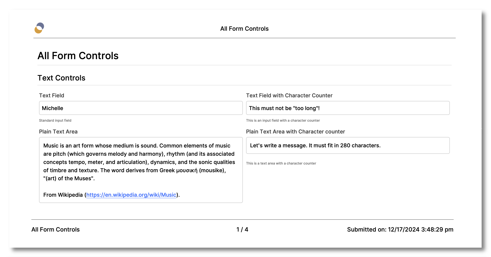

# Orbeon Forms 2023.1

__Sunday, December 31, 2023__  

[NOTE: THIS IS A PREVIEW, AND AS OF 2023-12-17, THIS VERSION OF ORBEON FORMS HASN'T BEEN RELEASED.]

Today we released Orbeon Forms 2023.1! This release is absolutely packed with new features and bug-fixes!

## Major new features

### Token-based permissions

This feature allows you to specify that a user can access form data with readonly or read-write permissions, provided that they are provided a link containing a permission token.

This introduces new permissions in the Form Runner permissions dialog:

<figure>
    <picture>
        
    </picture>
    <figcaption>Form Builder Permissions</figcaption>
</figure>

Links generated by Form Runner can optionally include a token that can be shared in a control value, template-generated output, including emails. The token is valid for a certain amount of time.


An optional "Share" icon is available at the top of a form's Detail page, which allows users to generate and copy a link with a token, provided the form supports token-based permissions.

<figure>
    <picture>
        
    </picture>
    <figcaption>Share icon and dialog</figcaption>
</figure>

New configuration properties are introduced to configure the token-based permissions feature. For more information, see the [documentation](https://doc.orbeon.com/form-runner/access-control/tokens).

### Comprehensive form and data export

This version introduces a powerful export feature. This is available from the Form Runner Admin page and lets you export a mix of form definitions and form data following several criteria. The result is a zip file containing all the exported form definitions and data, as well as associated attachments.

This is useful in particular for backup purposes and analytics. 


For more information, see the [documentation](/form-runner/feature/exporting-form-definitions-and-form-data.md)

### Purging of historical form data

This feature is related to the Export feature above. It allows you to delete form data following several criteria. This is useful for GDPR compliance, as well as for reducing the database size. 


For more information, see the [documentation](/form-runner/feature/purging-historical-data.md)

### Data revision history

Form Runner saves *revisions* of the data. Each revision of the data has an associated timestamp. Starting with Orbeon Forms 2023.1, Form Runner provides a UI to access the revision history of a given form data.

Note that this feature is distinct from [form definition versioning](/form-runner/feature/versioning.md).


For more information, see the [documentation](/form-runner/feature/revision-history.md)

### Configurable PDF header and footer

In past versions, you could configure the PDF header and footer using CSS. However, this was cumbersome and error-prone.

You can now configure the PDF header and footer using a declarative configuration. And if you need to add custom CSS, you can still do so, and it's easier than before.

<figure>
    <picture>
        
    </picture>
    <figcaption>PDF output with header and footer</figcaption>
</figure>

For more information, see the [documentation](/form-runner/feature/pdf-automatic-header-footer.md).

### Video component

You can now add static videos to a form. This is useful for illustrations, training, and other purposes.


You can see the Video component in action in the [Controls form](https://demo.orbeon.com/demo/fr/orbeon/controls/new?form-version=2&fr-wizard-page=attachment-controls).

For more information, see the [documentation](/form-runner/component/video.md).

### Bulk data updates

This new feature allows you to update multiple form data at once directly from a form's Summary page. This is useful for example to update the status of multiple forms at once.

For this to work, the form author must have enabled the "Allow bulk edit" option for at least one form control in the [Control Settings dialog](/form-builder/control-settings.md).


For more information, see the [documentation](/form-runner/feature/summary-page.md#bulk-edit).

### Configurable messages and resources in Form Builder

This new Form Builder dialog allows the form author to configure both:

- standard Form Runner messages, such as success and error messages
- and custom resources, such as Form Runner labels, hints, and other messages


For more information, see the [documentation](/form-builder/messages.md).

### Formula console

The Formulas console allows you to view formulas errors that occur when testing a form.


For more information, see the [documentation](/form-builder/formulas-console.md).

### Copying control content

This new Form Builder action allows you to explicitly copy complex form content from some controls to other controls, including handling of repetitions.


For more information, see the [documentation](/form-builder/actions-syntax.md#copying-control-content).

## Other new features and enhancements

### Option to store attachments in the filesystem

If you handle large and/or a large number of attachments, you can now configure Form Runner to store attachments in the filesystem instead of the database. This can improve performance and reduce the size of the database.

For more information, see the [documentation](/configuration/properties/persistence.md#attachments).

### Summary page processes

Form Runner supports processes associated with buttons, but so far this was only available on the Detail page. You can now configure processes associated with buttons on the Summary page.

For more information, see the [documentation](/form-runner/advanced/buttons-and-processes/summary-page-buttons-and-processes.md).

### Offline support for attachments

Form Runner now includes support for attachments in the offline mode.

Note that this feature is currently only usable when embedding Orbeon Forms within a native application. It is not available when using the Form Runner standalone web application. However, you can attach files in the "Test Offline" mode of Form Builder.

For more information, see the [API documentation](/form-runner/api/other/offline-embedding-api.md), and the [Test offline](/form-builder/offline-test.md) feature.

### Security features

#### SHA-256

Orbeon Forms now standardizes on SHA-256.

Note that this was also backported to Orbeon Forms 2022.1.3 and newer.

See the [documentation](/configuration/properties/general.md#oxf.crypto.hash-algorithm).

#### Improved encryption passwords

We have now separated `oxf.fr.field-encryption.password` and `oxf.crypto.password`, in addition to `oxf.fr.access-token.password` which is used by the tokens feature described above.

The `oxf.crypto.check-password-strength` property allows checking and reporting about password strength.

See the [documentation](/configuration/properties/general.md#oxf.crypto.check-password-strength).

### Performance improvements 

The following performance enhancements should be noted:

- Form Builder "Edit Source" performance with large form definitions
- Landing page loading
- Free text search performance with PostgreSQL

TODO:

- Persistence proxy/relational to cache form definition #5655

### Usability and accessibility features

#### Grid Tab Order 

You can now set whether the tab navigation order within a grid is:

- By row first, then by column
- By column first, then by row

See the [documentation](/form-builder/grid-settings.md#grid-tab-order).

#### HTML autocomplete attribute

The new "Autocomplete attribute" dropdown allows specifying an [HTML autocomplete value](https://developer.mozilla.org/en-US/docs/Web/HTML/Attributes/autocomplete).

See the [documentation](/form-builder/control-settings.md#autocomplete-attribute).

#### Other usability and accessibility features

- Form Runner
    - The Wizard supports separate short section labels ([doc](/form-builder/section-settings.md#label-help-message-and-short-labels))
    - Empty file attachments are now rejected by default ([doc](/xforms/controls/upload.md#empty-files))
    - Invalid attachment messages are improved
    - Automatic hints are supported for the maximum file size and file types ([doc](/form-builder/control-settings.md#automatic-hints))
    - Automatically focus on the first invalid field after closing Errors/Validation dialogs
    - The Excel import now shows errors immediately when reviewing uploaded data
    - The "Date" field supports the native date picker on the desktop ([doc](/form-runner/component/date.md#native-date-picker))
    - New experimental properties allow configuring automatic PDF accessibility and PDF/A settings ([doc](/form-runner/feature/pdf-automatic.md#accessibility-and-pdf-a-support))
- Form Builder usability
    - "Test PDF" produces meaningful filenames
    - Cmd/Ctrl-Enter commit the value in "Edit Source"
    - You are warned when referring to a non-existent variable in a formula
    - You can easily reset the value of a "Yes/No Answer" ([doc](/form-runner/component/yesno-input.md))

TODO:

- Add suggestion of variable names in all formulas #5798

### New and improved APIs

- Client-side APIs
    - The Wizard supports navigating to a specific section via URL ([doc](/form-runner/feature/wizard-view.md#page-name-url-parameter))
    - New JavaScript API to register a listener for process callbacks ([doc](/form-runner/advanced/buttons-and-processes/actions-form-runner.md#registering-a-callback-function), [doc](/form-runner/advanced/buttons-and-processes/actions-form-runner.md#callback))
    - New JavaScript API to get a reference to an object representing a Form Runner form ([doc](/form-runner/api/other/form-runner-javascript-api.md#getting-a-reference-to-a-form))
    - New JavaScript API to activate Process buttons ([doc](/form-runner/api/other/form-runner-javascript-api.md#activating-a-process-button))
    - New JavaScript API to activate a form control ([doc](/form-runner/api/other/form-runner-javascript-api.md#activating-a-form-control))
    - Improved JavaScript to set the value of a form control ([doc](/form-runner/api/other/form-runner-javascript-api.md#setting-a-controls-value))
- Server-side APIs
    - Pass page path and parameters information to FileScanProvider2 ([doc](/form-runner/api/other/file-scan-api.md#api))
    - Export services to be exposed as pages #5382
    - Service / API to produce PDF from data #3493
    - Consider enabling PDF parameters for service calls #5958

### Other features

TODO:

- Improve handling of expired session on the client #5678
- Ability to download the form definition #5608
  - [doc](https://doc.orbeon.com/form-builder/form-editor/buttons-bar)
- Show dialog warning users their session is about to expire #5890 ([doc](https://doc.orbeon.com/contributors/state-handling#session-expiration-dialog))
- "Show on Summary page" / "Restrict to role" to support multiple roles with and/or logic #5994 ([doc](https://doc.orbeon.com/form-builder/form-editor/control-settings#basic-settings))
- Summary page field search to show values in dropdown for controls without static items #6014 ([doc](/form-runner/feature/summary-page.md#dynamic-dropdowns))
- Open selection in dynamic dropdown with search #5858
- Add "copy to clipboard" button next to HTTP service response #3064
- Ability, in view mode, to show TOC on the left #5796 ([properties doc](https://doc.orbeon.com/configuration/properties/form-runner/form-runner-detail-page#show-table-of-contents), [doc](TODO))
- Validate lists of choices #6043 (import)
- Add Catalan language to form-runner #5659
- Improved Norwegian resources
- Rich text: ability to preserve colors in PDF #4158 ([doc](/form-runner/feature/pdf-automatic.md#pdf-color-mode))
- `xxf:sort()` to support `lang`, `collation`, and `stable` parameters #5794
- Form Builder: search by form name yields unexpected results #5928
- Form Runner `success-message()` and `error-message()` to support HTML #4964 ([doc](https://doc.orbeon.com/form-runner/advanced/buttons-and-processes/actions-form-runner#success-message-and-error-message))
- Excel/XML export button on Summary page #5264 ([doc](https://doc.orbeon.com/form-runner/advanced/buttons-and-processes/summary-page-buttons-and-processes#configuring-summary-page-buttons))
    - also on 2022.1.5 
    - also `xml-export`
- Form Runner XPath functions for permissions #2834 ([doc](https://doc.orbeon.com/xforms/xpath/extension-functions/extension-form-runner#authentication-functions))
- Configuration for image annotation start stroke color #6042 ([doc](https://doc.orbeon.com/form-runner/component/image-annotation))
- Ability to configure the databound dropdown with search with a minimum input length #6051 ([doc](https://doc.orbeon.com/form-runner/component/static-dynamic-dropdown#minimum-input-length))
- Optionally allow required stars to show in PDF #5959 ([doc](https://doc.orbeon.com/form-runner/advanced/buttons-and-processes/actions-form-runner#open-rendered-format))

### Enhancements to email sending

TODO: screenshot and move up

- Improved user interface for email attachments settings
- You can now send an email conditionally for a specific template ([doc](/form-builder/email-settings.md#usage))
- You can now specify custom email headers, even dynamically ([doc](/form-builder/email-settings.md#custom-headers))

### Enhancements to actions

TODO:

- Asynchronous actions ([doc](https://doc.orbeon.com/form-builder/advanced/services-and-actions/actions-syntax#asynchronous-actions))
- Add `fr:control-setfocus` action #5697 ([doc](https://doc.orbeon.com/form-builder/advanced/services-and-actions/actions-syntax#setting-the-focus-on-a-form-control))
    - also on 2022.1.2 
- Add `fr:control-setvisited` action #5694 ([doc](https://doc.orbeon.com/form-builder/advanced/services-and-actions/actions-syntax#marking-a-form-control-visited-or-unvisited))
    - also on 2022.1.2
- Add `fr:dataset-clear` action #5693 ([doc](https://doc.orbeon.com/form-builder/advanced/services-and-actions/actions-syntax#clearing-a-dataset))
    - also on 2022.1.2
- Add `fr:control-setsize` to the Action Syntax #5817 ([doc](https://doc.orbeon.com/form-builder/advanced/services-and-actions/actions-syntax#setting-the-size-of-an-attachment-control))
- Action syntax: support concurrent actions #5725
- Support action syntax in library forms / section templates #4814

### Embedding and offline

TODO:

- Support cross-site embedding with the Form Runner JavaScript embedding API #5974
- `embedForm()` returns a JavaScript `Promise` object representing the form. The object supports functions documented in [The `FormRunnerForm` object](/form-runner/api/other/form-runner-javascript-api.md#the-formrunnerform-object).
- Offline embedding API must offer Async API for services #5356
    - [doc](/form-runner/api/other/offline-embedding-api.md) 
- Offline: Dropdown with Search doesn't work #5637

### XForms features

- Support `event()` for `replace="all"` submissions ([doc](/xforms/submission-extensions.md#event-properties-with-replace-all))
- You can tunnel context information to submission and error events ([doc](/xforms/events-extensions-other.md#tunnelling-of-events-properties))
- Delayed events support passing atomic properties ([doc](/xforms/events-standard.md#delayed-events))

### Platform features

- We upgraded to Font Awesome 6
- Orbeon Forms now supports Tomcat 10+, WildFly 27+ (TODO)
- In addition to Ehcahe 2.x, we added support for the JCache API (JSR-107) ([doc](/installation/caches.md#enabling-jcache-providers))

## Compatibility notes

### Visiting of visible fields

In Orbeon Forms, a form control can be *visited* or not. Visited controls have typically been visited by the user, which means that the user navigated through the form control, possibly without changing its value. One way to visit form controls is to navigate using the "Tab" key, or to click on the form control and then click outside of it. Another way is to use the default "Save" or "Send" buttons, which by default visit all the form controls before proceeding. The notion is used to determine whether to show validation errors associated with that form control.

With Orbeon Forms 2023.1, form controls are also marked as visited when they are calculated, visible, and their value changes. This is useful to immediately show validation errors associated with such form controls, which are typically implemented with the Calculated Value form control.

If you don't wish this behavior, you can turn it off globally with the following property:

```xml
<property
    as="xs:boolean"
    name="oxf.xforms.xbl.fr.error-summary.visit-value-changed"
    value="false"/>
```

### Password strength checker

A [password strength checker](/configuration/properties/general.md#oxf.crypto.check-password-strength) will cause an error if one of the passwords configured in your `properties-local.xml` is too weak. Ideally, use randomly-generated strong passwords.

If you are using field-level encryption, and if you already have data in your database that contains encrypted fields, and if you are getting an error upon starting Orbeon Forms telling you that the encryption password is too weak, you can disable the password strength checker:

```xml
<property
    as="xs:boolean"
    name="oxf.crypto.check-password-strength"
    value="false"/>
```

We do not recommend disabling this in general. Instead, always use strong randomly-generated passwords. 

### Encryption passwords

If set, the `oxf.fr.field-encryption.password` property controls a separate encryption password for field-level encryption. If not set, the `oxf.crypto.password` property is used instead for backward compatibility.

```xml
<property
	as="xs:string"
	name="oxf.fr.field-encryption.password"
	value="CHANGE THIS PASSWORD"/>
```

- If you are upgrading from an earlier version of Orbeon Forms, and you already have data in your database that contains encrypted fields:
    - Set `oxf.fr.field-encryption.password` anyway, to the same value as `oxf.crypto.password`.
- If you are not in the above case, set `oxf.fr.field-encryption.password` to a value different from `oxf.crypto.password`. 

### CRUD API

When calling the [CRUD API](/form-runner/api/persistence/crud), you can `PUT` data as well as form definitions and their attachments.

When `PUT`ting data, Form Runner does a number of checks, including a check for permissions. In the past, in some cases, `PUT`ting data for a non-existent form definition could succeed. This is no longer the case, and you should make sure that the form definition exists before `PUT`ting data.

### eXist DB removal

This version of Orbeon Forms removes support for the eXist DB database. Use of this database has been deprecated for a long time, and we have not been able to maintain it for a while. If you are using eXist DB, please migrate to a [relational database](/form-runner/persistence/relational-db.md). (#5770)

### Uploading empty files

Starting with 2023.1, uploaded files that are empty are rejected out-of-the-box. Should you need to accept such files in your forms, you can [set a property to allow them](/xforms/controls/upload.md#empty-files).
