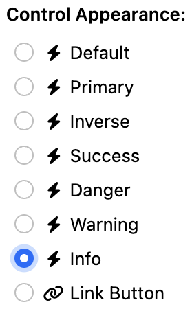
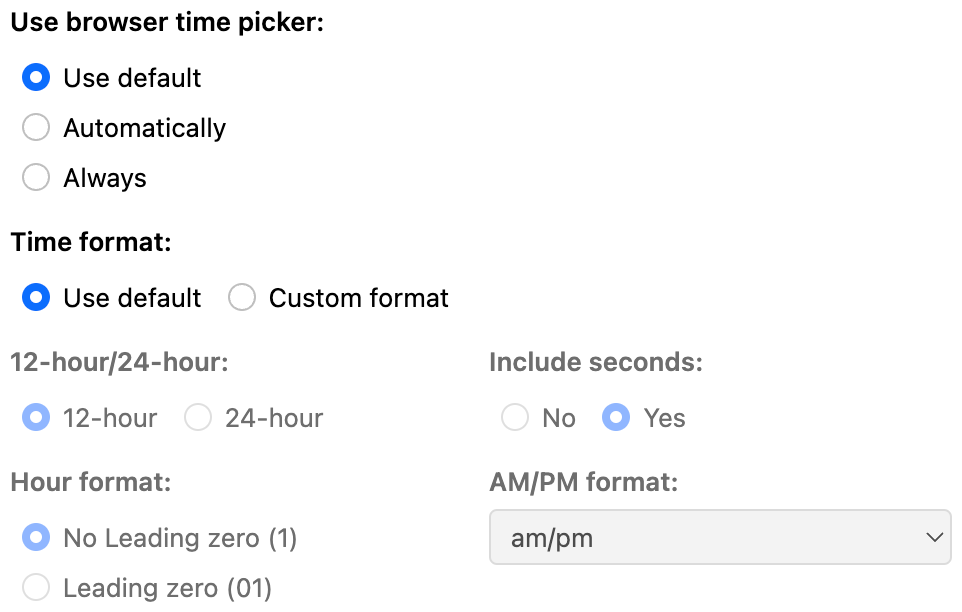

# Orbeon Forms 2024.1.1

__Xxx, March , 2025__

Today we released Orbeon Forms 2024.1.1! This maintenance release contains more than a hundred bug-fixes and some new features, and is recommended for all users of:

- [Orbeon Forms 2024.1 PE](orbeon-forms-2024.1.md)

## New features

### Suggest control and section name from the control label

Form controls and sections typically have a label, but also an internal name which is used in the data. Often, these match, for example:

- "Address" might be stored as `address`
- "Contractor business name" might be stored as `contractor-business-name`

If you haven't entered a name yet, the Form Builder will now suggest a name based on the label:

Simply click on the suggestion to accept it:

This also works in the "Section Settings" dialog for section names.

### Ability to filter itemset with a formula

The "Edit Choices" dialog allows you to filter choices based on a condition. This can, for example, exclude choices based on a selection made somewhere else in the form.

### Show a form's workflow stage in the Detail page

You can now opt to show the workflow stage in the navigation bar of the form's Detail page.

For more, see [Workflow stage](/form-runner/feature/workflow-stage.md#showing-the-workflow-stage-in-the-detail-page).

### Store email attachments to AWS S3

When sending an email using [the `email` action](/form-runner/advanced/buttons-and-processes/actions-form-runner-email.md), you can store attachments in an S3 bucket.

For more, see [S3 storage](/form-runner/feature/s3.md).

### Include UI for the various appearances of buttons

The "Control Settings" dialog now includes a UI for the various appearances of buttons:

<figure>
    <picture>
        
    </picture>
    <figcaption>Button appearances</figcaption>
</figure>

At runtime, this translates into various button appearances:

This was already supported at runtime, but there was no selector in the "Control Settings" dialog to set it.

### JavaScript embedding API to support Form Builder

The [Form Runner JavaScript Embedding API](/form-runner/link-embed/javascript-api.md) now allows you to embed Form Builder.

For more, see [JavaScript embedding API to support Form Builder](/form-runner/link-embed/javascript-api.md#form-builder-support).

### Ability to navigate grid cells using cursor up/down

We continue to add keyboard shortcuts to Form Builder. It has been possible to navigate between grid cells with the Left and Right cursor (arrow) keys.

You can now also use the Up and Down cursor keys to move up and down in the form, including going across grid and section boundaries. Here are the shortcuts currently supported:

| Key       | Description                                                               |
|-----------|---------------------------------------------------------------------------|
| `←`/`→`   | Move to the previous or next grid cell, including empty cells.            |
| `⇧←`/`⇧→` | Move to the previous or next grid cell, skipping empty cells.             |
| `↑`/`↓`   | Move to the previous or next grid cell vertically, including empty cells. |

This is very useful when combined with other keyboard shortcuts, such as:

- `⇧↵` (Shift-Enter or Shift-Return) to open the [Control Settings dialog](/form-builder/control-settings.md)
- `⌘X` or `⌃X` to cut the current control
- `⌘C` or `⌃C` to copy the current control
- `⌘V` or `⌃V` to paste from the toolbox

For more, see [Keyboard shortcuts](/form-builder/keyboard-shortcuts.md#grid-navigation-shortcuts).

## Native time picker

You can select in Form Builder whether the browser time form control should always be used.

<figure>
    <picture>
        
    </picture>
    <figcaption>Configuring the time format</figcaption>
</figure>

### New configuration properties

You can now configure the Form Runner summary page to start with the Search Options open. For more, see [Search options opened on load](/form-runner/feature/summary-page.md#search-options-opened-on-load).

You can also configure the Form Runner Landing page tile size. For more, see [Landing page tile size](/form-runner/feature/landing-page.md#configuration-properties).

## Issues addressed

- Form Builder
    - Reloading toolbox shows error in logs ([\#6801](https://github.com/orbeon/orbeon-forms/issues/6801))
    - FB: Time Control: Option to enable native Time Picker ([\#6719](https://github.com/orbeon/orbeon-forms/issues/6719))
    - Title specified when creating a new form not taken into account ([\#6745](https://github.com/orbeon/orbeon-forms/issues/6745))
    - Renamed control is not updated in Email Settings ([\#6741](https://github.com/orbeon/orbeon-forms/issues/6741))
    - FB: `fb-construct-done-or-refresh` runs too often ([\#6752](https://github.com/orbeon/orbeon-forms/issues/6752))
    - Resource URL in HTTP Service Editor to support reference to variable declared in model ([\#6740](https://github.com/orbeon/orbeon-forms/issues/6740))
    - "Use browser date picker" is missing a "Use default" option ([\#6714](https://github.com/orbeon/orbeon-forms/issues/6714))
    - Keyboard shortcuts to navigate between tabs inside dialogs ([\#6720](https://github.com/orbeon/orbeon-forms/issues/6720))
    - "Undeclared variable in XPath expression: $form-resources" reported by Test console ([\#6400](https://github.com/orbeon/orbeon-forms/issues/6400))
    - Support templates in validation error messages ([\#6710](https://github.com/orbeon/orbeon-forms/issues/6710))
    - "Cannot read properties of null (reading 'parentElement')" when removing template parameter inside tab ([\#6721](https://github.com/orbeon/orbeon-forms/issues/6721))
    - Form Builder logo is not configurable via properties ([\#3955](https://github.com/orbeon/orbeon-forms/issues/3955))
    - FB: missing attachments validations in Control Settings ([\#6725](https://github.com/orbeon/orbeon-forms/issues/6725))
    - Email Settings: control search dropdown is cropped ([\#6763](https://github.com/orbeon/orbeon-forms/issues/6763))
    - Avoid warning about target `fb-custom-form-settings` that can't be found when load Form Builder ([\#6753](https://github.com/orbeon/orbeon-forms/issues/6753))
    - Support variable references in Actions Editor / Service Request Actions / Formula ([\#6766](https://github.com/orbeon/orbeon-forms/issues/6766))
    - HTML tags for control label showing Email Settings dialog, template parameters ([\#6772](https://github.com/orbeon/orbeon-forms/issues/6772))
    - When opening a form in Form Builder, if another user already has a lease on that form, the current user sees an empty form ([\#6779](https://github.com/orbeon/orbeon-forms/issues/6779))
    - Form templates: backward compatibility for `template.xml` ([\#6782](https://github.com/orbeon/orbeon-forms/issues/6782))
    - In the dialog that shows when creating a new form, the Form Description textarea expands beyond the dialog ([\#6770](https://github.com/orbeon/orbeon-forms/issues/6770))
    - Control Settings: incorrect description/appearances with some form controls ([\#6811](https://github.com/orbeon/orbeon-forms/issues/6811))
    - Support keyboard shortcuts with modifiers when the focus is on a form field ([\#6814](https://github.com/orbeon/orbeon-forms/issues/6814))
    - Chrome suggests email addresses for "Email template name" in the "Email Settings" dialog ([\#6828](https://github.com/orbeon/orbeon-forms/issues/6828))
    - Toolbox keyboard shortcuts for controls are missing ([\#6830](https://github.com/orbeon/orbeon-forms/issues/6830))
    - When creating a form, allow Enter to be used to confirm the template selection ([\#6849](https://github.com/orbeon/orbeon-forms/issues/6849))
    - FB: Missing highlight of repeated grid cell borders upon hover ([\#6839](https://github.com/orbeon/orbeon-forms/issues/6839))
    - FB: can't drag and drop control second time ([\#6864](https://github.com/orbeon/orbeon-forms/issues/6864))
    - Control label HTML markup appears in Control Settings title and control name suggestion ([\#6866](https://github.com/orbeon/orbeon-forms/issues/6866))
    - Permissions dialog columns should be wider for non-English languages ([\#6876](https://github.com/orbeon/orbeon-forms/issues/6876))
    - Renaming a service referenced by an action breaks the reference ([\#6880](https://github.com/orbeon/orbeon-forms/issues/6880))
    - "Incorrect XPath expression" error after variable completion in formulas ([\#6873](https://github.com/orbeon/orbeon-forms/issues/6873))
    - "Incorrect XPath expression" error doesn't disappear if field is cleared ([\#6875](https://github.com/orbeon/orbeon-forms/issues/6875))
    - Control label HTML markup appears in control dropdowns ([\#6877](https://github.com/orbeon/orbeon-forms/issues/6877))
    - Actions dialog: undesired labels show ([\#6893](https://github.com/orbeon/orbeon-forms/issues/6893))
    - Renaming a control doesn't update variables in "Enable this template..." expression ([\#6897](https://github.com/orbeon/orbeon-forms/issues/6897))
    - Rectangle appearing below formula email template parameter when control variable dropdown displayed ([\#6898](https://github.com/orbeon/orbeon-forms/issues/6898))
- Form Runner
    - "Can't find element or iteration with ID" error with Java embedding ([\#6838](https://github.com/orbeon/orbeon-forms/issues/6838))
    - Landing: occasional error with tile for Bookshelf form ([\#6760](https://github.com/orbeon/orbeon-forms/issues/6760))
    - Form Builder and Form Runner to sanitize all HTML input and output ([\#6533](https://github.com/orbeon/orbeon-forms/issues/6533))
    - Value of field not saved if changed just before saving with cmd/ctrl-s ([\#6818](https://github.com/orbeon/orbeon-forms/issues/6818))
    - `save` then `email` fails for logged in users ([\#6739](https://github.com/orbeon/orbeon-forms/issues/6739))
    - If Form Builder is disabled or removed, Landing page should not show entries in Quick Links pointing to Form Builder ([\#6743](https://github.com/orbeon/orbeon-forms/issues/6743))
    - Incorrect automatic hint when multiple file format are accepted ([\#6724](https://github.com/orbeon/orbeon-forms/issues/6724))
    - Second phase of `xf:submission replace="all"` unnecessarily send all the field values to the server ([\#6682](https://github.com/orbeon/orbeon-forms/issues/6682))
    - Ambiguous rule match error for Controls form ([\#6709](https://github.com/orbeon/orbeon-forms/issues/6709))
    - Avoid `max(last_modified_time)` on `orbeon_form_data` ([\#6711](https://github.com/orbeon/orbeon-forms/issues/6711))
    - Add "Orbeon" to default logo after it was removed from page names ([\#6723](https://github.com/orbeon/orbeon-forms/issues/6723))
    - Text of hints, labels for disabled controls lacks contrast ([\#6726](https://github.com/orbeon/orbeon-forms/issues/6726))
    - Top alert buttons (lease, documents, time window) too high with long text ([\#6727](https://github.com/orbeon/orbeon-forms/issues/6727))
    - Email process to ignore CC and BCC recipients when test-to is specified ([\#6732](https://github.com/orbeon/orbeon-forms/issues/6732))
    - File Scan: mediatype update is not checked against constraints ([\#6738](https://github.com/orbeon/orbeon-forms/issues/6738))
    - If user can't acquire lease, provide option to go to the summary page ([\#6793](https://github.com/orbeon/orbeon-forms/issues/6793))
    - Avoid Ehcache warning "Statistics can no longer be enabled via configuration" ([\#6754](https://github.com/orbeon/orbeon-forms/issues/6754))
    - Markup produced for `<xf:group xxf:appearance="internal">` ([\#6758](https://github.com/orbeon/orbeon-forms/issues/6758))
    - Error uploading file with Maximum Aggregate Attachment Size ([\#6762](https://github.com/orbeon/orbeon-forms/issues/6762))
    - Landing: form data card doesn't show loading spinner ([\#6767](https://github.com/orbeon/orbeon-forms/issues/6767))
    - Client can crash on JSON itemset with missing value attribute ([\#6786](https://github.com/orbeon/orbeon-forms/issues/6786))
    - Human-readable file sizes ([\#5277](https://github.com/orbeon/orbeon-forms/issues/5277))
    - Modal loading indicator to show below modal dialog ([\#6769](https://github.com/orbeon/orbeon-forms/issues/6769))
    - Add `fr:can-list()` function ([\#6791](https://github.com/orbeon/orbeon-forms/issues/6791))
    - Login detected and session about to expire and expired dialogs to use HTML `<dialog>` instead of Bootstrap modal ([\#6798](https://github.com/orbeon/orbeon-forms/issues/6798))
    - Remove Repetition from the Repeated Section in simplified appearance doesn't work ([\#6802](https://github.com/orbeon/orbeon-forms/issues/6802))
    - 500 in `/xforms-server/upload` uploading to image annotation with max size aggregate per form set ([\#6804](https://github.com/orbeon/orbeon-forms/issues/6804))
    - When selecting an email template the enableIfTrue logic should be applied before the all/first logic ([\#6806](https://github.com/orbeon/orbeon-forms/issues/6806))
    - Actions: resolve variable to control related to action source ([\#6837](https://github.com/orbeon/orbeon-forms/issues/6837))
    - Attach PDF value set to true in email templates ignored if property set to false ([\#6842](https://github.com/orbeon/orbeon-forms/issues/6842))
    - In "file uploaded is too large" also show size in bytes ([\#6847](https://github.com/orbeon/orbeon-forms/issues/6847))
    - Nontranslated resources displayed on login/logout pages ([\#6658](https://github.com/orbeon/orbeon-forms/issues/6658))
    - Fix ([\#6819](https://github.com/orbeon/orbeon-forms/issues/6819)): on mobile, keep header if one column
    - 404 loading resources in embedding with `encode-version` set to `false` ([\#6833](https://github.com/orbeon/orbeon-forms/issues/6833))
    - ISIN formula returns false negative ([\#6855](https://github.com/orbeon/orbeon-forms/issues/6855))
    - `//a` doesn't work in `oxf.fr.detail.button.B.visible.*.*` ([\#6858](https://github.com/orbeon/orbeon-forms/issues/6858))
    - Section with "Page break before" doesn't stick after reopening in Form Builder ([\#6865](https://github.com/orbeon/orbeon-forms/issues/6865))
    - Pressing Enter with the focus on an empty date field's calendar button selects the current date ([\#6872](https://github.com/orbeon/orbeon-forms/issues/6872))
    - Make button opening the JavaScript date picker accessible ([\#6863](https://github.com/orbeon/orbeon-forms/issues/6863))
    - `send()` action doesn't work in `before-publish` process ([\#6892](https://github.com/orbeon/orbeon-forms/issues/6892))
    - Add `xf:bind/@name` if missing ([\#6860](https://github.com/orbeon/orbeon-forms/issues/6860))
    - Label repeated on every row of one-column repeated grid on mobile ([\#6819](https://github.com/orbeon/orbeon-forms/issues/6819))
Closed
    - No "Summary" link when creating data for a singleton form ([\#6878](https://github.com/orbeon/orbeon-forms/issues/6878))
- Accessibility
    - In view, label of date and number fields isn't read ([\#6707](https://github.com/orbeon/orbeon-forms/issues/6707))
    - Placeholder on input not shown if `xxbl:label-for` pointing to that input ([\#6543](https://github.com/orbeon/orbeon-forms/issues/6543))
- Offline
    - Offline: passing query string with `fr-language=fr` has no effect ([\#6788](https://github.com/orbeon/orbeon-forms/issues/6788)) 
    - Offline: `fr:tinymce` uses `xxf:call-xpl()` ([\#6112](https://github.com/orbeon/orbeon-forms/issues/6112))
    - Offline: TinyMCE can't find model URL in `new` mode ([\#6722](https://github.com/orbeon/orbeon-forms/issues/6722))
    - JS: `<xf:setvalue>` with inline value doesn't work ([\#6861](https://github.com/orbeon/orbeon-forms/issues/6861))
    - JS: repeated grid menu items are blank ([\#6879](https://github.com/orbeon/orbeon-forms/issues/6879))
- Form controls
    - Clarify/update natural vs. full width controls in readonly modes ([\#6808](https://github.com/orbeon/orbeon-forms/issues/6808))
    - Enable native time picker on iOS ([\#4787](https://github.com/orbeon/orbeon-forms/issues/4787))
    - Friendly Captcha: add configurable endpoints ([\#6697](https://github.com/orbeon/orbeon-forms/issues/6697))
    - Dynamic Dropdown with Search: open selection doesn't appear to work ([\#6704](https://github.com/orbeon/orbeon-forms/issues/6704))
    - Dynamic Dropdown with Search: UI for open selection no longer works ([\#6705](https://github.com/orbeon/orbeon-forms/issues/6705))
    - CodeMirror in XForms Inspector empty when initially opened ([\#6716](https://github.com/orbeon/orbeon-forms/issues/6716))
    - Handwritten Signature: readonly to readwrite shows blank content ([\#6730](https://github.com/orbeon/orbeon-forms/issues/6730))
    - Time: support 3 and 4-digit without separator completion ([\#6746](https://github.com/orbeon/orbeon-forms/issues/6746))
    - Date: support Saturday as week start day ([\#6747](https://github.com/orbeon/orbeon-forms/issues/6747))
    - Dynamic dropdown with search get `xforms-value-changed` when opened ([\#6787](https://github.com/orbeon/orbeon-forms/issues/6787))
    - Attachments: setting `allow-download` to `false` doesn't work ([\#6795](https://github.com/orbeon/orbeon-forms/issues/6795))
    - Image Annotation shows two images ([\#6803](https://github.com/orbeon/orbeon-forms/issues/6803))
    - `fr:attachment` doesn't dispatch `xforms-value-changed` ([\#6815](https://github.com/orbeon/orbeon-forms/issues/6815))
    - Attachment controls to show a more telling number of digits after the decimal for file sizes ([\#5789](https://github.com/orbeon/orbeon-forms/issues/5789))
- PDF
    - Section arrows show in PDF ([\#6694](https://github.com/orbeon/orbeon-forms/issues/6694))
    - PDF shows initial blank page in some cases ([\#6771](https://github.com/orbeon/orbeon-forms/issues/6771))
    - PDF: Orbeon logo no longer shows in header ([\#6796](https://github.com/orbeon/orbeon-forms/issues/6796))
    - PDF: Empty signature can overflow ([\#6841](https://github.com/orbeon/orbeon-forms/issues/6841))
    - PDF header/footer lines cannot be removed with CSS ([\#6851](https://github.com/orbeon/orbeon-forms/issues/6851))
    - PDF: Long explanatory text causes page break #6903
- Performance
    - Reindexing: use batch updates for INSERT ([\#6731](https://github.com/orbeon/orbeon-forms/issues/6731))
    - Reindexing: avoid reading data when unnecessary ([\#6773](https://github.com/orbeon/orbeon-forms/issues/6773))
    - Reading form definition during reindexing can cause connection pool starvation ([\#6834](https://github.com/orbeon/orbeon-forms/issues/6834))
    - Formula with a sum of 28 variables takes minutes to compile ([\#5948](https://github.com/orbeon/orbeon-forms/issues/5948))
- Other
    - Document how to deploy Docker images to Microsoft Azure ([\#6613](https://github.com/orbeon/orbeon-forms/issues/6613))
    - Jar files in `lib/provided` are incorrectly included in `WEB-INF/lib` ([\#6757](https://github.com/orbeon/orbeon-forms/issues/6757))
    - Mounting standalone.xml into WildFly image doesn't work ([\#6759](https://github.com/orbeon/orbeon-forms/issues/6759))
    - Remove last use of Parboiled 1 ([\#5000](https://github.com/orbeon/orbeon-forms/issues/5000))
    - Clean-up tests using `oxf.url-rewriting.service.base-uri` ([\#6835](https://github.com/orbeon/orbeon-forms/issues/6835))
    - Third-party libraries updates
    - Fix ([\#6713](https://github.com/orbeon/orbeon-forms/issues/6713)): XForms Inspector with dialogs

You can download the latest version of Orbeon Forms from the [downloads](https://www.orbeon.com/download) page, or use our Docker images.

Don't forget to [grab a trial license](https://prod.orbeon.com/prod/fr/orbeon/register/new) for the PE version.

Please send feedback via [Twitter](https://twitter.com/orbeon), [Mastodon](https://mastodon.social/@orbeon), or the [forum](https://www.orbeon.com/community).

We hope you enjoy this release!
