# Orbeon Forms 2024.1

__Tuesday, December 31, 2024__  

Today we released Orbeon Forms 2024.1! This release is absolutely packed with new features and bug-fixes!

## Major new features

### Introduction

With Orbeon Forms 2024.1, we are introducing a number of major new features. Several of them contribute to improving usability, navigability, and visibility of forms and form data.

In addition, some features improve the deployment of Orbeon Forms, including cloud deployment, and deployment with JavaScript embedding. 

### Improved "New Form" dialog with templates

In previous versions, creating an entirely new form with Form Builder always started with a default blank template.

The "New Form" dialog now starts with a series of form templates that you can choose from. There are built-in form templates, but you can make your own form templates.

<figure>
    <picture>
        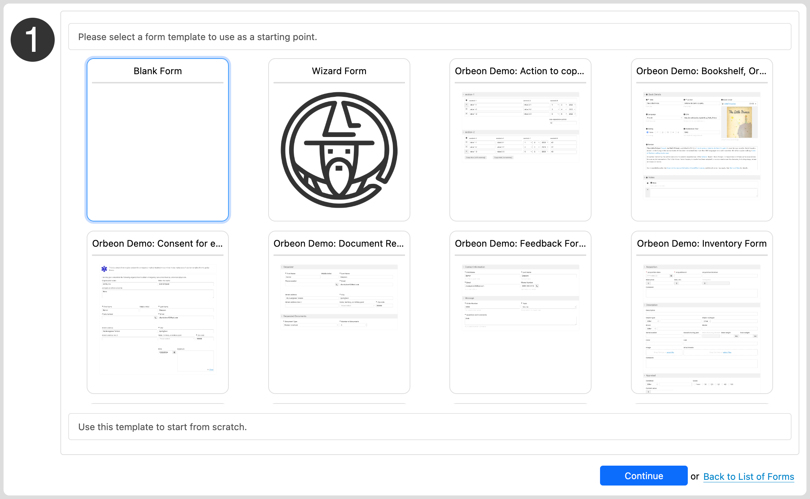
    </picture>
    <figcaption>New Form dialog with templates</figcaption>
</figure>

In addition, providing a form application name and form name is now optional when you start. You can provide them later, after you've started working on the form. This makes getting started on a new form more straightforward. Finally, when you pick an application name and form name, Form Builder checks the in-progress and published forms for a match to tell you whether that combination is already in use.

<figure>
    <picture>
        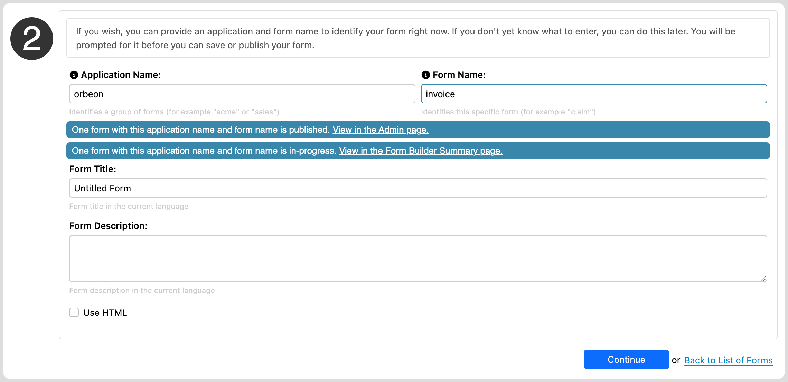
    </picture>
    <figcaption>Choosing an application and form name</figcaption>
</figure>

You can mark any form you create as a template, and that form will then show in the list of available templates.

<figure>
    <picture>
        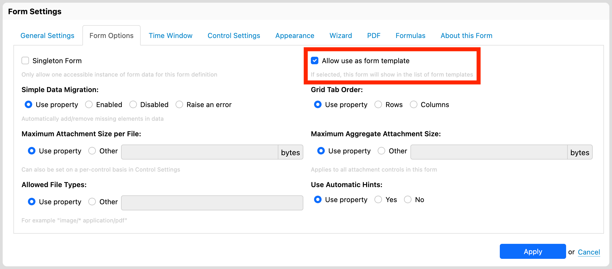
    </picture>
    <figcaption>Marking a form as available as a template</figcaption>
</figure>

You can associate a thumbnail with each form, which will be used in the Form Builder New page as well as on the Landing page (see below). That thumbnail can be a screenshot of the form, or any other graphic you choose.

<figure>
    <picture>
        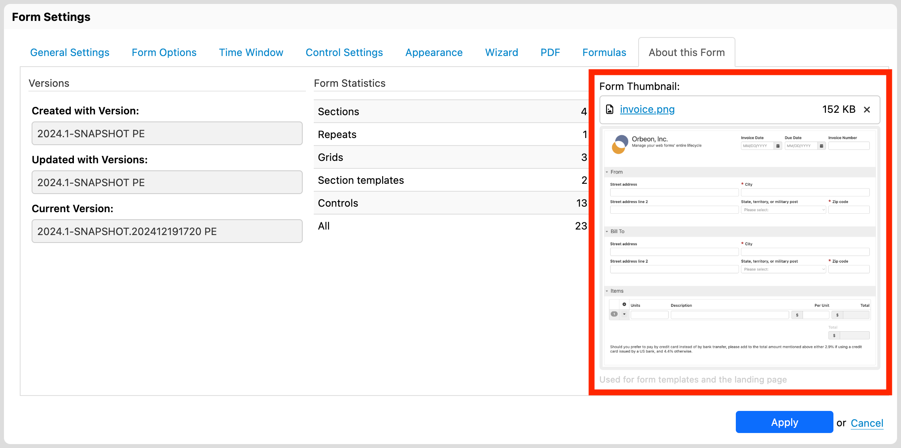
    </picture>
    <figcaption>Setting a thumbnail for a form</figcaption>
</figure>

### Sorting and improved searching on the Summary page

The Form Runner Summary page already allowed you to *search*, but it now allows you to *sort by metadata or field* as well.

<figure>
    <picture>
        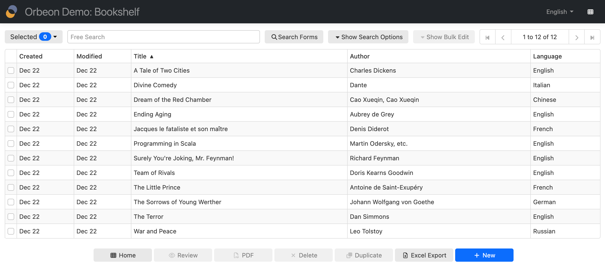
    </picture>
    <figcaption>Sorting by "Title" field on the Summary page</figcaption>
</figure>

In addition, search has been improved to search and sort by the following metadata information (when present):

- Created Date
- Last Modified Date
- Created by Username
- Last Modified by Username
- Workflow Stage

<figure>
    <picture>
        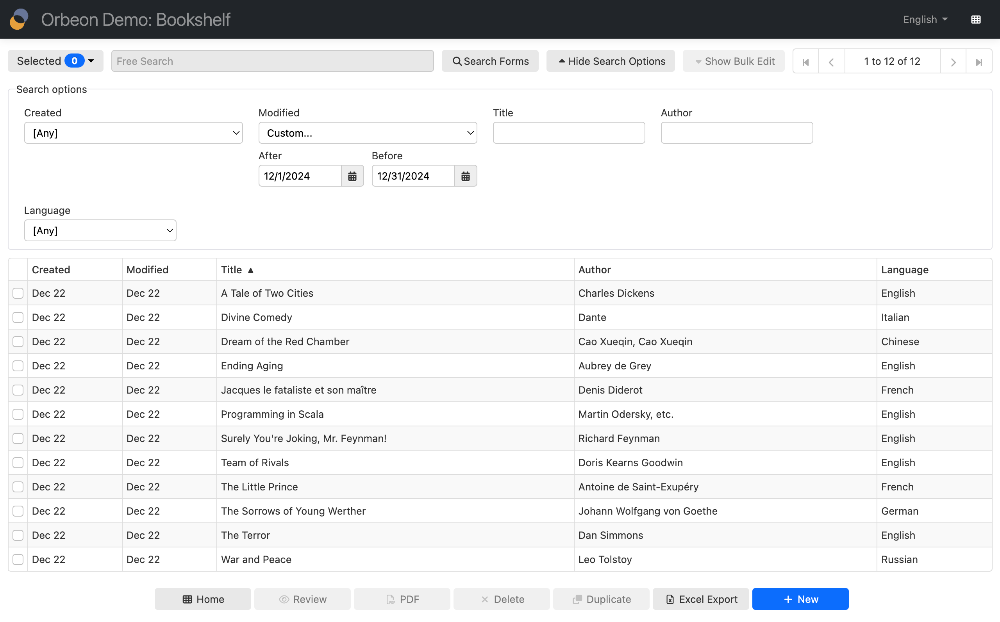
    </picture>
    <figcaption>Search by Last Modified Date on the Summary page</figcaption>
</figure>

See also [this video](https://www.youtube.com/watch?v=udsIa9raVfg) which covers the topic.

<!-- TODO: embed -->

###  Improved date format configuration

The Orbeon Forms Date control got improved in a couple of ways. Like for the [Time form control](https://www.orbeon.com/2023/01/time-form-control-improvements.html), we have made the format a configuration of the Date control. This means that you can specify the date format for each Date control individually, at the form level, or in configuration properties, as is the case for all other form control configurations in Orbeon Forms.

The format allows you to control the following:

- the order of the fields: Month first, Day first, Year first
- the separator to use
- pad the months and days with zeros or not

<figure>
    <picture>
        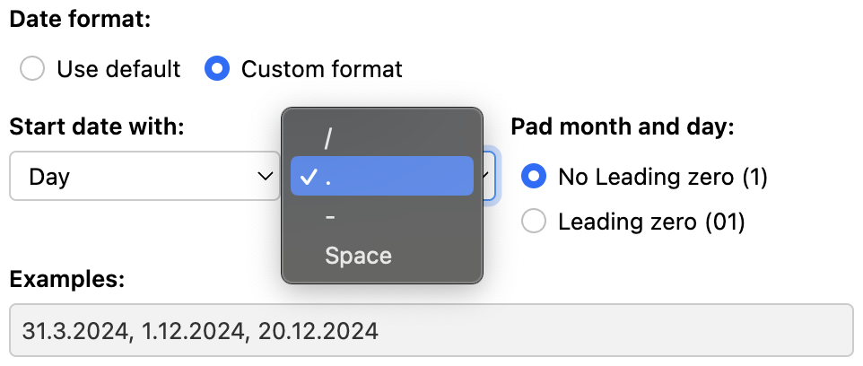
    </picture>
    <figcaption>Custom date format configuration</figcaption>
</figure>

If you are configuring this at the form control or form level, you can do this in the Form Builder UI, so you don’t have to figure out a textual syntax (but you still use such a syntax in Orbeon Forms configuration properties).

In addition, we have fixed other issues with the Date control, and we have brought a couple of existing configurations to the Form Builder UI:

- Use browser date picker
- First day of the week

<figure>
    <picture>
        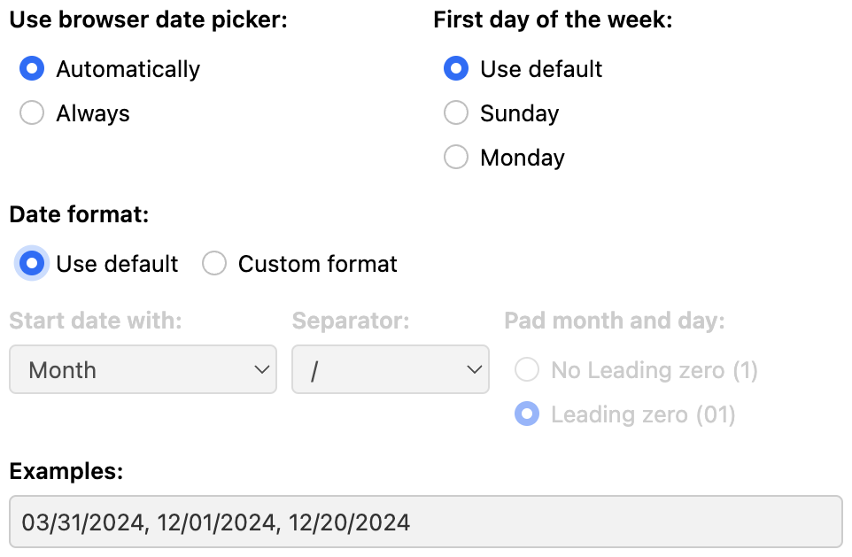
    </picture>
    <figcaption>Browser date picker and first day of the week</figcaption>
</figure>

The following shows examples of Date and Time controls at runtime:

<figure>
    <picture>
        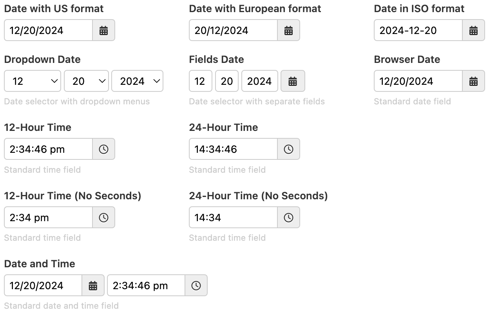
    </picture>
    <figcaption>Date and time controls</figcaption>
</figure>

### Sorting and searching on the Admin and Published Forms pages

The Forms/Admin and Forms/Published pages now allow you to sort as well.

<figure>
    <picture>
        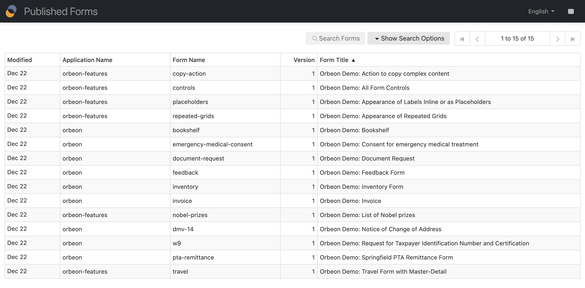
    </picture>
    <figcaption>Sorting by "Form Title" on the Admin and Published Forms pages</figcaption>
</figure>

You can also search by metadata or field. 

<figure>
    <picture>
        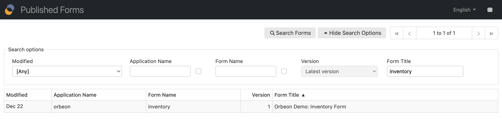
    </picture>
    <figcaption>Sorting and searching by "Form Title" on the Admin and Published Forms pages</figcaption>
</figure>

See also [this video](https://www.youtube.com/watch?v=udsIa9raVfg) which covers the topic.


### Form Density Setting

You now have a choice of several form density settings:

- __Compact:__ This is the current default with Orbeon Forms until 2023.1.
- __Comfortable:__ This is the default for forms created with Orbeon Forms 2024.1 and later.
- __Roomy:__ Choose this for even more spacing between controls.

This setting can be set globally, per app, or per form, with a setting in Form Builder as well.

<figure>
    <picture>
        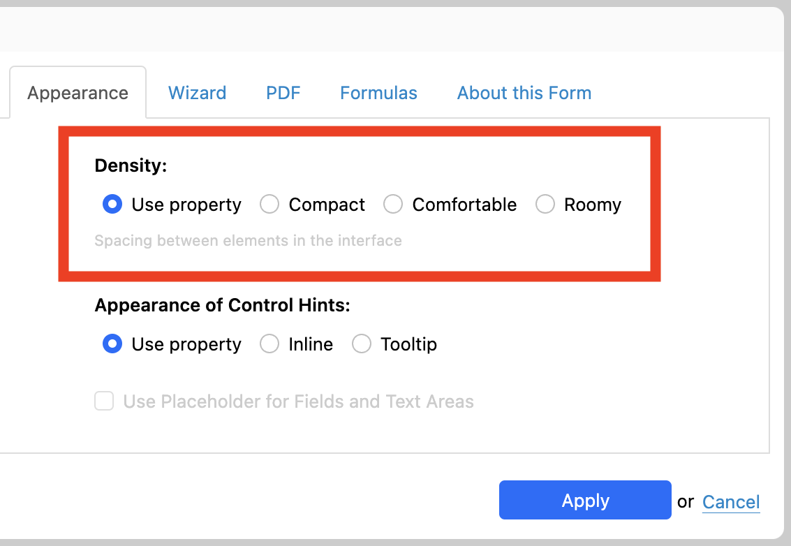
    </picture>
    <figcaption>Form Density Setting</figcaption>
</figure>

For more, see also the [Form Density Setting](https://www.orbeon.com/2024/11/form-density) blog post.

### Variable completion in formulas

Like in a spreadsheet, a formula can reference other form control values. Formulas now provide completion of control names: simply type the `$` character, and a completion menu appears. It shows not only the name of the field, but also its label.

<figure>
    <picture>
        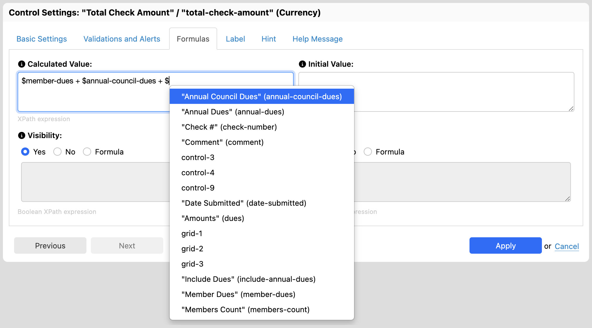
    </picture>
    <figcaption>Variable completion in formulas</figcaption>
</figure>

For more, see also the [Variable completion in formulas](https://www.orbeon.com/2024/12/variable-completion-formulas) blog post.

### Landing page improvements

The Orbeon Forms Landing page, introduced with Orbeon Forms 2022.1, now allows you to show cards showing the latest data for specific forms that you configure. This gives you quick access to your important data.

<figure>
    <picture>
        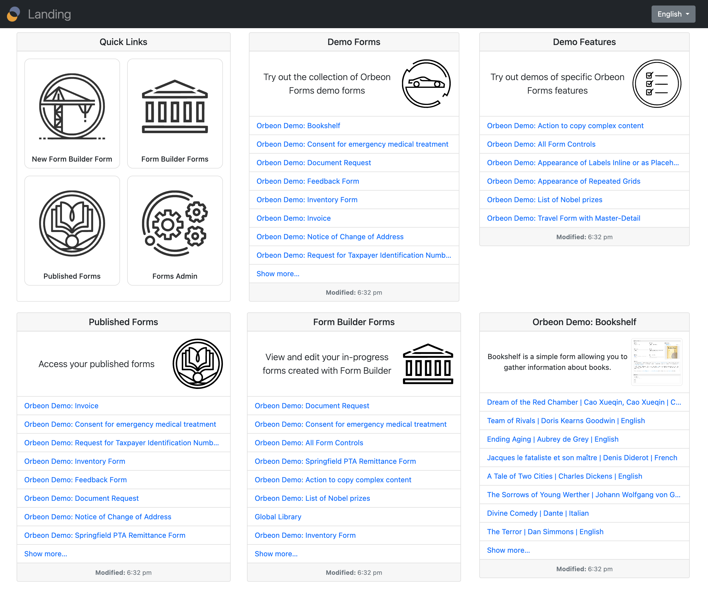
    </picture>
    <figcaption>Landing page with cards</figcaption>
</figure>

In addition, we have split the Orbeon Demo Forms and Demo Features. These, of course, are just examples, and can easily be removed with a simple configuration for your dev, test, or production environments.

### Angular and React components for form embedding

We have added two new components for form embedding:

- __Angular component.__ For details, see [Angular component](/form-runner/link-embed/angular-component.md) blog post.
- __React component.__ For details, see [React component](/form-runner/link-embed/react-component.md) blog post.

These components allow you to embed forms in Angular or React applications. They add to our existing embedding APIs:

- [Form Runner server-side Java embedding API](/form-runner/link-embed/java-api.md)
- [Form Runner proxy portlet](/form-runner/link-embed/liferay-proxy-portlet.md)
- [Form Runner JavaScript Embedding API](/form-runner/link-embed/javascript-api.md)
- [Form Runner offline embedding API](/form-runner/link-embed/offline-embedding-api.md)

### New naming convention for the global library

Form Builder supports reusable *section templates*, which can be present in two separate *libraries*:

- A global library, usable from any form in the system.
- An application-specific library, usable from forms in the same application.

Previously, the global library was named `orbeon/library`, while an application `acme`'s library was named `acme/library`. We didn't like that the global library was named `orbeon/library`, as:

1. It wasn't clear that this was a global library rather than a library for forms in the `orbeon` application.
2. Some users who do white-labeling might not want to see the name `orbeon` appear.

With this Orbeon Forms version, we have moved the global library to an anonymous application called `_` (which stands for "global" or "placeholder" or "wildcard"), and the global library is now named `_/library`. This is not truly meant to be seen by form authors or end users, but rather it is an internal name.

For backward compatibility, the `orbeon/library` library is still available. A new global library should be created with the new name. If both libraries are present, both are shown by Form Builder.

### Support for OpenID Connect (OIDC)

We added support for [OpenID Connect (OIDC)](https://en.m.wikipedia.org/wiki/OpenID#OpenID_Connect_(OIDC)) as an authentication method when using the WildFly container. This is a step towards easily allowing deploying Orbeon Forms on cloud services such as Microsoft Azure, Google Cloud, and Amazon Web Services.

### Support for leases in Form Builder

Previously, a [Lease](/form-runner/feature/lease.md) was only supported for published forms. With this version, leases are supported for Form Builder itself. This allows to better control how multiple form authors can edit a form in Form Builder without conflicts.

<figure>
    <picture>
        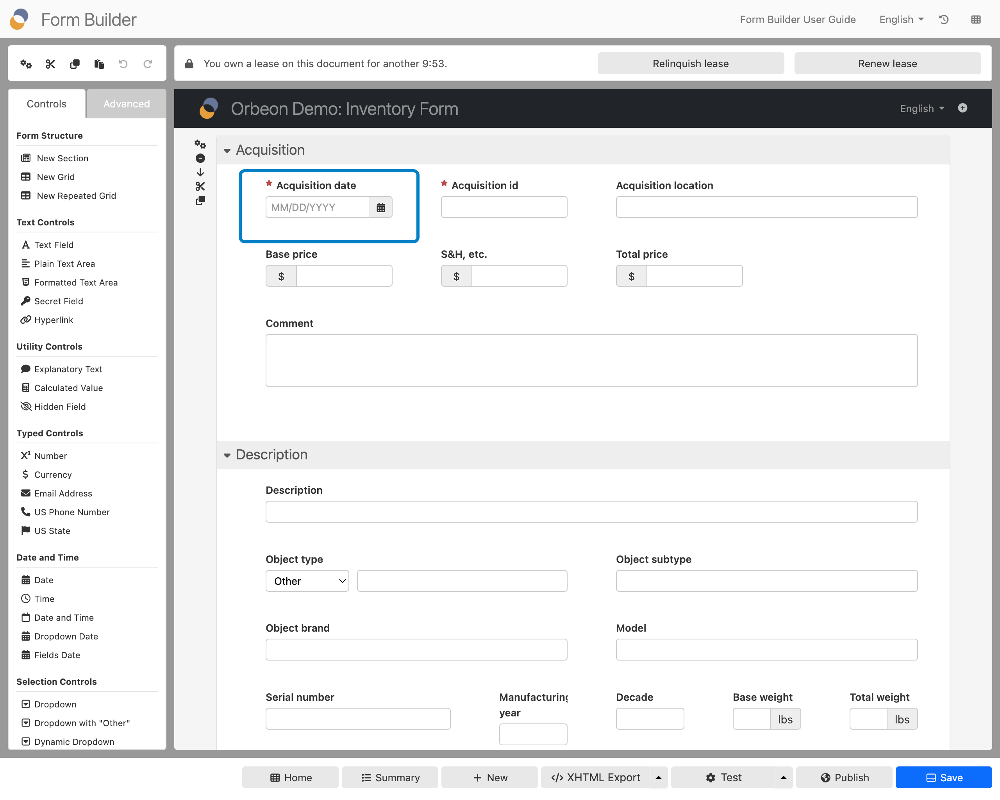
    </picture>
    <figcaption>Message showing the user owns the lease</figcaption>
</figure>

### Keyboard shortcuts

With Orbeon Forms 2023.1.3, we had already added a number of keyboard shortcuts in Form Builder (see [the "Improved Keyboard Shortcuts" blog post](https://www.orbeon.com/2024/07/keyboard-shortcuts)).

With this release, we have added more keyboard shortcuts, including shortcuts to enter specific form controls. This can greatly accelerate how power users create forms.

For details, see [Keyboard Shortcuts](/form-builder/keyboard-shortcuts.md#inserting-form-controls).

### Page load and service performance

We have simplified our internal router. This can improve performance for page loads and service calls. This is noticeable in particular with the [Form definitions and form data Zip Export](/form-runner/feature/exporting-form-definitions-and-form-data.md), where exports can be 30% faster.

## Other new features and enhancements

Orbeon Forms 2024.1 also includes many other new features and enhancements, including:

- Support repeats in relational flat views ([\#1069](https://github.com/orbeon/orbeon-forms/issues/1069))
- Add support for flat views in MySQL ([\#6284](https://github.com/orbeon/orbeon-forms/issues/6284))
- Form author with access to two apps only sees forms in the first one, in the Form Builder summary page ([\#878](https://github.com/orbeon/orbeon-forms/issues/878))
- Copy section settings when inserting section template ([\#3495](https://github.com/orbeon/orbeon-forms/issues/3495))
- Form metadata API: support paging ([\#5493](https://github.com/orbeon/orbeon-forms/issues/5493))
- Ability to customize, in Form Builder, the "add another line" link, for minimal repeated grids ([\#5742](https://github.com/orbeon/orbeon-forms/issues/5742))
- Ability to use variable references in service URL AVT ([\#5782](https://github.com/orbeon/orbeon-forms/issues/5782))
- Improve US Address section template ([\#5997](https://github.com/orbeon/orbeon-forms/issues/5997))
- Dynamic dropdown ability to auto-selecting only choice returned by the service ([\#5999](https://github.com/orbeon/orbeon-forms/issues/5999))
- Bulk update to be able to trigger process ([\#6055](https://github.com/orbeon/orbeon-forms/issues/6055))
- Maximum Aggregate Attachment Size constraint for Multiple File Attachments control ([\#6064](https://github.com/orbeon/orbeon-forms/issues/6064))
- Form Builder UI for enabling the attachment of the XML to the email sent ([\#6120](https://github.com/orbeon/orbeon-forms/issues/6120))
- Document, clarify, and extend process success, failure ([\#6137](https://github.com/orbeon/orbeon-forms/issues/6137))
- Background API: provide ability to run a process by name ([\#6185](https://github.com/orbeon/orbeon-forms/issues/6185))
- reCAPTCHA v3 support ([\#6222](https://github.com/orbeon/orbeon-forms/issues/6222))
- Ability to configure the plain dropdown with search with a minimum input length ([\#6245](https://github.com/orbeon/orbeon-forms/issues/6245))
- Improvements to configuration warning banner ([\#6267](https://github.com/orbeon/orbeon-forms/issues/6267))
- Unify edit and view TOC appearances ([\#6373](https://github.com/orbeon/orbeon-forms/issues/6373))
- Support autofocus attribute ([\#6411](https://github.com/orbeon/orbeon-forms/issues/6411))
- Bulk update not to lose selection ([\#6498](https://github.com/orbeon/orbeon-forms/issues/6498))
- "US State" control: also add territories ([\#6505](https://github.com/orbeon/orbeon-forms/issues/6505))
- Allow Cmd-Enter or Ctrl-Enter to be used to "apply" dialogs ([\#6545](https://github.com/orbeon/orbeon-forms/issues/6545))
- Redis support for replication, through Redisson as JCache implementation ([\#6554](https://github.com/orbeon/orbeon-forms/issues/6554))
- Forms/Admin page: support URL parameters for search ([\#6557](https://github.com/orbeon/orbeon-forms/issues/6557))
- Summary: improve look when no data ([\#6559](https://github.com/orbeon/orbeon-forms/issues/6559))
- Form Runner resources for Hungarian ([\#6628](https://github.com/orbeon/orbeon-forms/issues/6628))
- Date picker configuration to highlight current date ([\#6643](https://github.com/orbeon/orbeon-forms/issues/6643))
- Tell user if selected app/form exists in-progress/published ([\#6644](https://github.com/orbeon/orbeon-forms/issues/6644))
- New property to control if the wizard validates on page change ([\#6647](https://github.com/orbeon/orbeon-forms/issues/6647))
- Error Summary: support showing only messages down to a given level ([\#6649](https://github.com/orbeon/orbeon-forms/issues/6649))
- Ability to set the relevant and readonly of iterations in repeated grids and repeated sections ([\#5724](https://github.com/orbeon/orbeon-forms/issues/5724))
- XForms support for multiple labels ([\#4758](https://github.com/orbeon/orbeon-forms/issues/4758))
- Add service provider to help with connection context passing ([\#6157](https://github.com/orbeon/orbeon-forms/issues/6157))
- Support serving files with the xml extension ([\#6214](https://github.com/orbeon/orbeon-forms/issues/6214))
- Services to use the `Cache-Control: no-store` header ([\#6221](https://github.com/orbeon/orbeon-forms/issues/6221))

Platform updates:

- We have upgraded to Scala 2.13, with some uses of Scala 3 as well.
- We use native browser dialogs using the `<dialog>` HTML element.
- We have upgraded many third-party open-source dependencies.

The following enhancements are part of 2024.1, but have also been backported to 2023.1.x maintenance releases:

- 2023.1.3
    - Persistence proxy to log reasons for 400 Bad Request ([\#6372](https://github.com/orbeon/orbeon-forms/issues/6372))
    - Allow hiding the title of a section ([\#6288](https://github.com/orbeon/orbeon-forms/issues/6288)) (also on 2023.1.3)
    - Show label/name of current control in Control Settings dialog title ([\#6292](https://github.com/orbeon/orbeon-forms/issues/6292))
    - Don't show upload metadata if readonly and missing ([\#6298](https://github.com/orbeon/orbeon-forms/issues/6298))
    - Show hints for keyboard shortcuts ([\#6306](https://github.com/orbeon/orbeon-forms/issues/6306))
    - Excel table export from Summary page ([\#6323](https://github.com/orbeon/orbeon-forms/issues/6323))
    - `fr:dropdown-select1` to support minimal label ([\#6333](https://github.com/orbeon/orbeon-forms/issues/6333))
- 2023.1.4
    - Refactor persistence layer permissions ([\#5741](https://github.com/orbeon/orbeon-forms/issues/5741))
    - ProcessorService: log HTTP method and URL parameters ([\#6414](https://github.com/orbeon/orbeon-forms/issues/6414))
    - Reflow/responsive repeated grids on devices with narrow screens ([\#4491](https://github.com/orbeon/orbeon-forms/issues/4491))
    - Process action to create a new document id ([\#6435](https://github.com/orbeon/orbeon-forms/issues/6435))
    - Support Friendly Captcha ([\#6439](https://github.com/orbeon/orbeon-forms/issues/6439))
    - Add captcha-reset process action ([\#6441](https://github.com/orbeon/orbeon-forms/issues/6441))
- 2023.1.5
    - Add `getNativeSession` on `Session` instances ([\#6465](https://github.com/orbeon/orbeon-forms/issues/6465))
    - Support `xxf:itemset()` with Dynamic dropdown with search (`databound-select1-search.xbl`) ([\#6444](https://github.com/orbeon/orbeon-forms/issues/6444))
    - Date control placeholder to be localized in Spanish, Czech, and Turkish ([\#6496](https://github.com/orbeon/orbeon-forms/issues/6496))
    - Option not to show the "Require token" row ([\#6500](https://github.com/orbeon/orbeon-forms/issues/6500))
    - Dropdowns "please select" to be localized in Czech and Turkish ([\#6502](https://github.com/orbeon/orbeon-forms/issues/6502))
- 2023.1.6
    - Allow custom model variables references in formulas ([\#6145](https://github.com/orbeon/orbeon-forms/issues/6145))
    - Form Builder Export: consider not saving before ([\#6562](https://github.com/orbeon/orbeon-forms/issues/6562))
    - Property to disable the keyboard shortcuts hints ([\#6605](https://github.com/orbeon/orbeon-forms/issues/6605))
    - Revision History: button to add older revisions ([\#6623](https://github.com/orbeon/orbeon-forms/issues/6623))

## Compatibility and upgrade notes

### Namespace attributes at the top of properties-local.xml

You need to make sure that your main Orbeon Forms configuration file, `properties-local.xml`, features `xmlns:fr` and `xmlns:xxf` attributes at the top. Your existing file might start with:

```xml
<properties
    xmlns:xs="http://www.w3.org/2001/XMLSchema"
    xmlns:oxf="http://www.orbeon.com/oxf/processors"
>
    ... content of the configuration file here ...
```

Make sure to include the  `xmlns:fr` and `xmlns:xxf` attributes as well, for example:

```xml
<properties
    xmlns:xs="http://www.w3.org/2001/XMLSchema"
    xmlns:oxf="http://www.orbeon.com/oxf/processors"
    xmlns:fr="http://orbeon.org/oxf/xml/form-runner"
    xmlns:xxf="http://orbeon.org/oxf/xml/xforms"
>
    ... content of the configuration file here ...
```

Failing to have these configuration attributes might prevent Orbeon Forms from starting. These attributes are present on the template file, `properties-local.xml.template`, provided with Orbeon Forms.

### Disabling the embedded SQLite database

Orbeon Forms comes with an embedded SQLite database in order to show demo forms, and also to allow to quickly get started with Orbeon Forms. This maps to a provider called `sqlite`. To disable access to the embedded database after you have [set up your own relational database configuration](/form-runner/persistence/relational-db.md), make sure to also [disable the embedded SQLite database](/form-runner/persistence/relational-db.md#disabling-the-embedded-sqlite-provider).

### Excel export button on the Summary page

The default `oxf.fr.summary.buttons` configuration property now includes `excel-export-with-search` by default. This means that, by default, a user can export the Summary page content in Excel format. If you do not wish this, you can set your own `oxf.fr.summary.buttons` configuration property.

### Deprecation of catpcha tokens in configuration

Previously, the `oxf.fr.detail.captcha` or `oxf.fr.detail.captcha.component` supported tokens, including:

- `reCAPTCHA`
- `SimpleCaptcha`
- `OnPremiseCaptcha`

With this version, component names should be used instead, as follows:

- `fr:recaptcha`
- `fr:friendly-captcha`
- `fr:on-premise-captcha`

There is backward compatibility support for tokens. For details see [Captcha components](/form-runner/component/captcha.md).

### reCAPTCHA v3

Orbeon Forms now supports reCAPTCHA v3. For this reason, the configuration properties have changed. 

For details see [Captcha components](/form-runner/component/captcha.md).

### Simple data migration

The default is changed from `disabled` to `enabled` for new forms, with the following built-in property:

```xml
<property
    as="xs:string"  
    name="oxf.fr.detail.data-migration.*.*"                              
    value="{if (fr:created-with-or-newer('2024.1')) then 'enabled' else 'disabled'}"/>
```

Although we do not recommend it, you can revert to the older behavior with:

```xml
<property
    as="xs:string"  
    name="oxf.fr.detail.data-migration.*.*"                              
    value="disabled"/>
```

### Index names

We previously had a typo in the names of some indexes for SQL Server, PostgreSQL, Oracle, and MySQL: some indices began with `orbeon_from` instead of `orbeon_form`. Although this typo doesn't cause any issues, you may want to check for it during your upgrade and rename the affected indices for consistency. We corrected this typo in the DDL we provided in November 2024, so if you created your indices before that date, you likely have this typo.

### Date formats
 
With this release, for Date controls, `the oxf.xforms.format.output.date` property is no longer used in readonly modes. Instead, the `output-format` parameter of the time field is used, which defaults to the value of the global `oxf.xforms.format.input.time` property.

See [Date](/form-runner/component/date.md) component for more information.