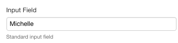
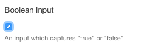
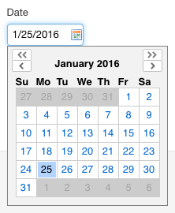
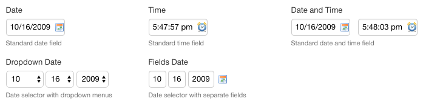
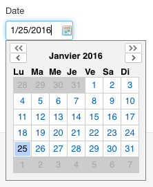

# Input Control

<!-- toc -->

## Basic Usage

```xml
<xf:input ref="text"/>
```

## Standard appearance

By default, the text area control is rendered as a regular single-line input field:



_Examples of input fields_

### Attributes

#### HTML attributes

With the standard appearance, the following attributes are available and forwarded to the corresponding HTML element:

- `xxf:maxlength`
- `xxf:pattern`
    - SINCE Orbeon Forms 4.11
- `xxf:autocomplete`
- `xxf:size`
    - not recommended, use CSS instead
- `xxf:title`
    - SINCE Orbeon Forms 4.11
    - can be useful for accessibility

Example:

```xml
<xf:input ref="text" xxf:autocomplete="off/>
```

### Placeholder for label and hint

The label or hint associated with `<xf:input>` may have the `minimal`  appearance:

```xml
<xf:input ref=".">
    <xf:label appearance="minimal">Your name</xf:label>
    <xf:hint>Hint</xf:hint>
</xf:input>

<xf:input ref=".">
    <xf:label>Your name</xf:label>
    <xf:hint appearance="minimal">Hint</xf:hint>
</xf:input>
```

This causes either the label or the hint to appear on the background of the field when it is empty.

Orbeon Forms leverages the HTML 5 `placeholder` attribute for browsers that support it (Firefox 3.5+, Chrome, Safari, Opera), and simulates the HTML 5 `placeholder` functionality  in JavaScript for browsers that don't support it (all versions of IE). In that case, you can customize how the placeholder is displayed by overriding the CSS class `x``forms-placeholder`.

_NOTE: The `xxf:placeholder` appearance can also be used instead of the `minimal` appearance. Initially the feature only supported `xxf:placeholder` and support for `minimal` was added upon discussion with the W3C Forms Working Group._

## Appearance based on type and appearance

The way the XForms input control is be rendered on the page depends on the type of the node it is bound to, and possibly the control's appearance:

| Type          | Appearance          | Description |
| ------------- | ------------------- | ----------- |
| `xs:string`   |                     | standard input field |
| `xs:string`   | `character-counter` | input field with [character counter](../../form-runner/component/character-counter.md) |
| `xs:boolean`  |                     | single checkbox |
| `xs:date`     |                     | input field with date picker and date parsing and formatting |
| `xs:date`     | `dropdowns`         | maps to `fr:dropdown-date` |
| `xs:date`     | `fields`            | maps to `fr:fields-date` |
| `xs:date`     | `minimal`           | icon with date picker without an input field |
| `xs:time`     |                     | input field with time parsing and formatting |
| `xs:dateTime` |                     | combined date and time fields |







## date, time, and dateTime types

### Date picker configuration

When using the date picker, you can choose whether you want 2 months to be displayed instead of one, and whether users should be able to quickly navigate to a specific year and month by setting the [`oxf.xforms.datepicker.navigator`][3] property.

*NOTE: Make sure not to use the date picker inside an `<xh:p>`.*

### Smart date and time format

The date and time fields allow you to type a date and a time in a number of formats, as listed below. When the field looses the focus, the value you entered is parsed and, if recognized, replaced with a value in a a "canonical format".

You can choose what canonical format is used by changing the value of the [oxf.xforms.format.input.date and oxf.xforms.format.input.time properties][4].

Time formats:

| Example | Note | Regular expression |
|---|---|---|
| now | The current time | ^now$ |
| 12:34:56 p.m. |   | ^(d{1,2}):(d{1,2}):(d{1,2}) ?(p&#124;pm&#124;p.m.)$ |
| 12:34 p.m. | Is equivalent to 12:34:00 p.m. | ^(d{1,2}):(d{1,2}) ?(p&#124;pm&#124;p.m.)$ |
| 12 p.m. | Is equivalent to 12:00:00 p.m.  | ^(d{1,2}) ?(p&#124;pm&#124;p.m.)$ |
| 12:34:56 (a.m.) |    |  ^(d{1,2}):(d{1,2}):(d{1,2}) ?(a&#124;am&#124;a.m.)?$ |
| 12:34 (a.m.) |   | ^(d{1,2}):(d{1,2}) ?(a&#124;am&#124;a.m.)?$ |
| 12 (a.m.) |   | ^(d{1,2}) ?(a&#124;am&#124;a.m.)?$ |
| 123456 | Is equivalent to 12:34:56 | ^(d{1,6})$ |

Date formats:

| Example | Note | Regular expression |
|---|---|---|
| today |    | ^tod |
| tomorrow |    | ^tom |
| yesterday |   | ^yes |
| 4th | The 4th of the current year and month | ^(d{1,2})(st&#124;nd&#124;rd&#124;th)?$ |
| 4th Jan |   | ^(d{1,2})(?:st&#124;nd&#124;rd&#124;th)? (w+)$ |
| 4th Jan 2003 |   | ^(d{1,2})(?:st&#124;nd&#124;rd&#124;th)? (w+),? (d{2,4})$ |
| Jan 4th |   | ^(w+) (d{1,2})(?:st&#124;nd&#124;rd&#124;th)?$ |
| Jan 4th 2003 |   | ^(w+) (d{1,2})(?:st&#124;nd&#124;rd&#124;th)?,? (d{2,4})$ |
| When the `oxf.xforms.format.input.date`  property starts with `[M`: e.g. 10/20/2000  | "US format" (month first) with the year specified | ^(d{1,2}).(d{1,2}).(d{2,4})$ |
| When the `oxf.xforms.format.input.date`  property starts with `[D`: e.g. 20/10/2000 | "European format" (day first) with the year specified | ^(d{1,2}).(d{1,2}).(d{2,4})$ |
| When the `oxf.xforms.format.input.date`  property starts with `[M`: e.g. 10/20 | "US format" (month first) with no year specified | ^(d{1,2}).(d{1,2})$ |
| When the `oxf.xforms.format.input.date`  property starts with `[D`: e.g. 20/10 | "European format" (day first) with no year specified | ^(d{1,2}).(d{1,2})$ |
| 2000-10-20 | ISO or "Asian" format | (^d{4})-(d{1,2})-(d{1,2})(Z&#124;([+-]d{2}:d{2}))?$ |


### Two digits years

If you type in a date field a year with only two digits (say 5/20/10), the control will assume that you intended to type a year in the twentieth or twenty first century, rather than a year in the first century. It will convert the two-digit year you typed into a four digits year by taking the corresponding year in either the twentieth or twenty first century based on which one is closest to the current year. So for instance, if the current year is 2020:

* 10 is changed to 2010
* 80 is changed to 1980
* 60 is changed to 2060


### Date picker internationalization

By default, the months and days of the week are in English in the date picker (as shown in the screenshot above). You can  change this by setting the value of the lang attribute on the  element of the page. The value of the attribute two-letter [ISO 639-1 language code][5]. For instance with  months and weekdays will be shown in French, for instance:



For more on which languages are supported localized out-of-the-box, see [supported languages][7]. Note that the changing the language also changes which day of the week is shown first in the calendar: in English, Sunday is shown first; with French and Spanish, Monday is shown first.

### Date picker in scrollable area

If you are using the date picker in an area of your page which is scrollable (e.g. `<div style="overflow: scroll">`), if users scroll in that area while the date picker is open, you want the date picker to be anchored to the field it is related to and to scroll with the content of the scrollable area (versus being attached to the page, and only scrolling if the page is scrolled). For this to work, assuming you have the class `scrollable-area` on your scrollable area, you need to add the following CSS:

```css
.scrollable-area { position: relative }
```

### On iOS

On iOS (iPhone, iPad, iPod touch), inputs bound to nodes of type `xs:date`, `xs:time`, or `xs:dateTime` are rendered using the iOS 5 browser native date or time widgets, which iOS users are accustomed to, and which provides a better usability, especially on the smaller screen iPhone and iPod touch.

![iOS date picker][8]

![iOS time picker][9]

### Limitations

* If the time has a milliseconds part:
    * The time will be shown without the milliseconds part.
    * If users modify the time, the milliseconds part will be lost.
* If the time has a timezone specification:
    * The date will be shown as if the time zone indication was not there.
    * If users modify the time the time zone will be lost.

## Text input sanitation

[SINCE Orbeon Forms 4.0.1]

Input sanitation allows you to apply a filter on the data entered by the user, before the data is stored into instance data. One use of sanitation is to replace undesired characters. For example, the following will replace sign and double rounded quotes with straight quotes, several long dashes with regular dashes and ellipsis character with three dots:

```xml
<property as="xs:string" name="oxf.xforms.sanitize">
    {
        "&#x2018;": "&#039;",
        "&#x2019;": "&#039;",
        "&#x201c;": "\"",
        "&#x201d;": "\"",
        "&#x2013;": "&#045;",
        "&#x2014;": "&#045;",
        "&#x2219;": "&#045;",
        "&#x2022;": "&#045;",
        "&#x00BF;": "&#063;",
        "&#x2026;": "..."
    }
</property>
```

The configuration is a JSON map of string to string.  Each replacement is applied in the order in which it appears in the map. If the configuration is blank string, sanitation is turned off.

Sanitation applies to:

* input fields bound to string data
* text areas

You can also use the `xxf:sanitize` attribute on the XForms model to set a filter local to a given page.

[3]: ../../configuration/properties/xforms.html#navigator
[4]: ../../configuration/properties/xforms.html#for-xfinput
[5]: http://en.wikipedia.org/wiki/List_of_ISO_639-1_codes
[7]: ../../form-runner/feature/localization.html
[8]: ../images/xforms-ios-date.png
[9]: ../images/xforms-ios-time.png