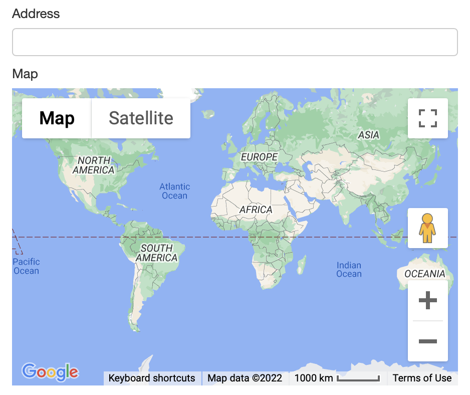
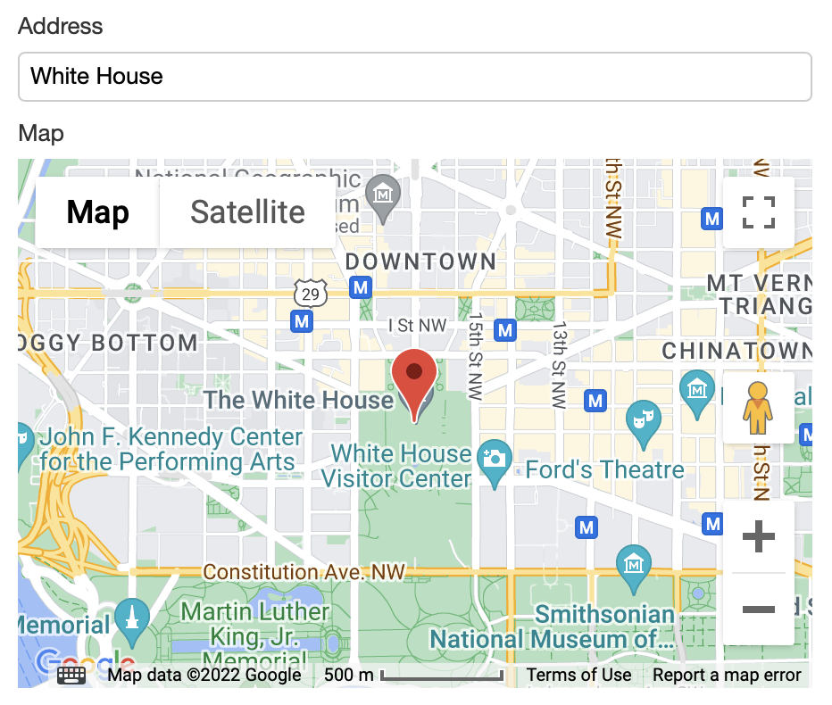

# Map XBL example

## Setup

1. If using Orbeon Forms 2022.1 or newer, the source of this example ships with the product. If using an earlier version, download the following 3 files mentioned in the Source section below, and place them in the Orbeon Forms `WEB-INF/resources/xbl/acme/map` directory (out-of-the-box, `WEB-INF/resources` already exists, but you'll need to create the subdirectories `xbl/acme/map`).
2. [Get a Google API Key](https://developers.google.com/maps/documentation/javascript/tutorial#api_key), and add the following 3 properties to your `properties-local.xml`, setting the value of the first property to your key.

```xml
<property as="xs:string" name="oxf.xforms.xbl.acme.map.key"         value=""/>
<property as="xs:string" name="oxf.xforms.xbl.mapping.acme"         value="http://www.acme.com/xbl"/>
<property as="xs:string" name="oxf.fb.toolbox.group.custom.uri.*.*" value="oxf:/xbl/acme/map/map.xbl"/>
```

## Usage

The map component shows the location of an address on the map, but doesn't by itself allow users to enter an address. So, in Form Builder, you'll want to first create a text field for users to enter an address. Say you name this field `address`. Then add a map control, which you'll find after scrolling to the very bottom of the left sidebar, open the Control Settings for the new, and under Formulas set its Calculated Value as `$address`. If you test the form, the map will show the map of the world.



Enter a location or address, press enter or tab out, and, if found, a marker will be added on the map at that location.



## Source

-  [`map.xbl`](https://github.com/orbeon/orbeon-forms/blob/master/form-runner/jvm/src/main/resources/xbl/acme/map/map.xbl)
-  [`map.js`](https://github.com/orbeon/orbeon-forms/blob/master/form-runner/jvm/src/main/assets/xbl/acme/map/map.js)
-  [`map.css`](https://github.com/orbeon/orbeon-forms/blob/master/form-runner/jvm/src/main/assets/xbl/acme/map/map.css)

